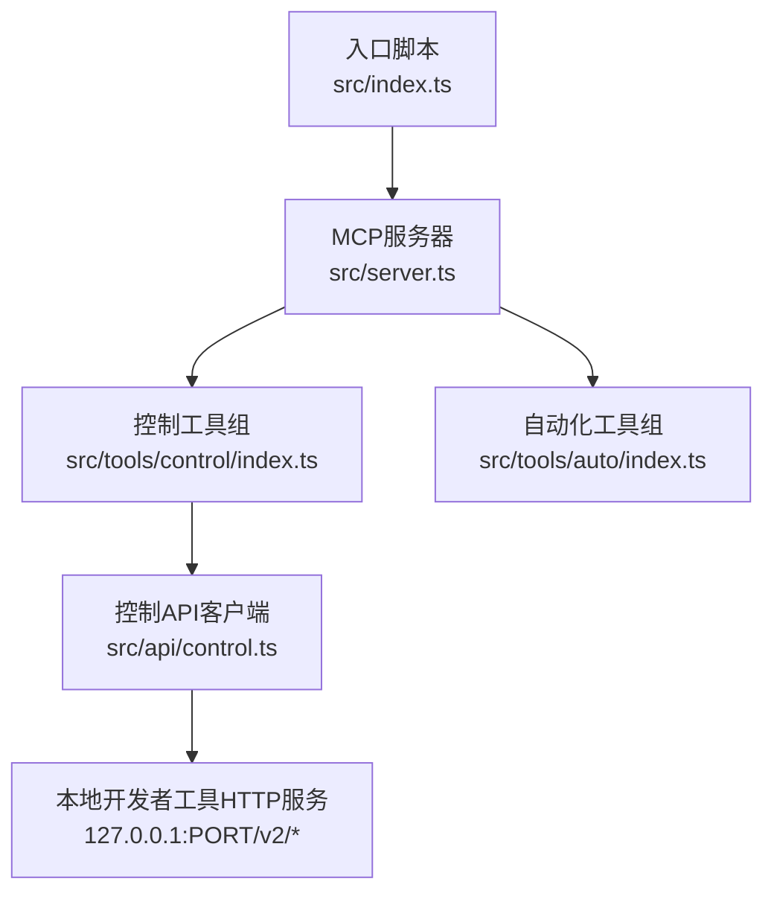
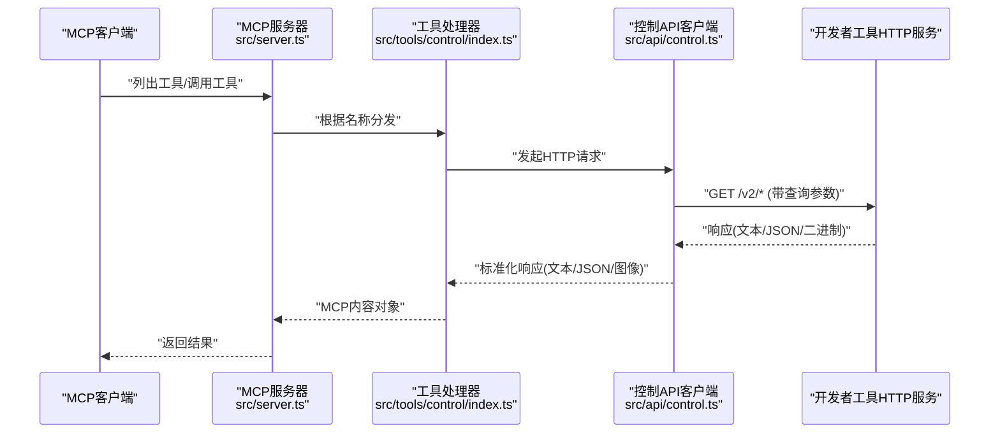
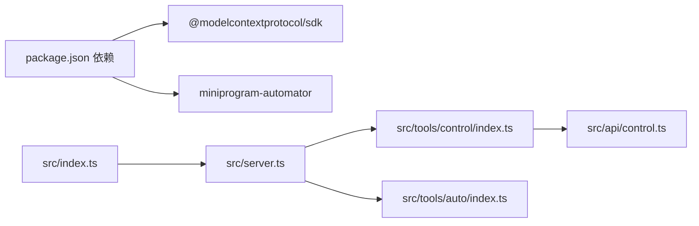

# API参考

<cite>
**本文引用的文件**
- [src/index.ts](file://src/index.ts)
- [src/server.ts](file://src/server.ts)
- [src/api/control.ts](file://src/api/control.ts)
- [src/tools/control/index.ts](file://src/tools/control/index.ts)
- [src/tools/auto/index.ts](file://src/tools/auto/index.ts)
- [src/api/control.test.ts](file://src/api/control.test.ts)
- [src/tools/control/index.test.ts](file://src/tools/control/index.test.ts)
- [src/tools/auto/index.test.ts](file://src/tools/auto/index.test.ts)
- [package.json](file://package.json)
- [README.md](file://README.md)
- [AGENTS.md](file://AGENTS.md)
- [tsconfig.json](file://tsconfig.json)
- [vitest.config.ts](file://vitest.config.ts)
</cite>

## 目录
1. [简介](#简介)
2. [项目结构](#项目结构)
3. [核心组件](#核心组件)
4. [架构总览](#架构总览)
5. [详细组件分析](#详细组件分析)
6. [依赖关系分析](#依赖关系分析)
7. [性能考虑](#性能考虑)
8. [故障排除指南](#故障排除指南)
9. [结论](#结论)
10. [附录](#附录)

## 简介
本文件为“微信小程序MCP服务器”的完整API参考文档，覆盖两类公开工具组：
- 控制API（以 wechat_control_* 命名）：基于本地运行的微信开发者工具HTTP服务（端口由环境变量指定），通过HTTP请求与开发者工具交互，实现登录、预览、上传、打开/关闭项目、退出、构建npm、清理缓存、重置文件监控等功能。
- 自动化API（以 wechat_auto_* 命名）：当前为占位实现，提供连接与页面导航等基础能力，后续可扩展至 miniprogram-automator 的具体自动化操作。

本参考文档详细说明每个工具的功能、输入参数、返回内容结构、错误处理机制，并给出HTTP方法、URL模式、认证方式、调用示例与最佳实践建议。

## 项目结构
- 入口与启动：入口脚本读取环境变量，初始化控制API配置，启动MCP服务器。
- MCP服务器：注册所有工具，接收客户端的工具列表与调用请求，分发到对应工具处理器。
- 控制API模块：封装对开发者工具HTTP服务的调用，自动解析响应类型（文本、JSON、二进制），并进行必要的格式转换（如二维码图像）。
- 工具实现：
  - 控制工具组：包含登录、预览、上传、打开/关闭项目、退出、自动预览、构建npm、清理缓存、重置文件工具、登录状态检查等。
  - 自动化工具组：当前包含连接与页面导航两个占位工具。

图表来源
- [src/index.ts:1-33](file://src/index.ts#L1-L33)
- [src/server.ts:14-71](file://src/server.ts#L14-L71)
- [src/tools/control/index.ts:1-326](file://src/tools/control/index.ts#L1-L326)
- [src/tools/auto/index.ts:1-22](file://src/tools/auto/index.ts#L1-L22)
- [src/api/control.ts:29-85](file://src/api/control.ts#L29-L85)

章节来源
- [src/index.ts:1-33](file://src/index.ts#L1-L33)
- [src/server.ts:14-71](file://src/server.ts#L14-L71)
- [src/api/control.ts:1-85](file://src/api/control.ts#L1-L85)
- [src/tools/control/index.ts:1-326](file://src/tools/control/index.ts#L1-L326)
- [src/tools/auto/index.ts:1-22](file://src/tools/auto/index.ts#L1-L22)

## 核心组件
- 入口与环境变量
  - 读取 WECHAT_DEVTOOLS_PORT（必填）、WECHAT_PROJECT_PATH（可选）、LOG_LEVEL（可选）等环境变量，初始化控制API配置并启动MCP服务器。
- MCP服务器
  - 注册工具列表与调用处理器，按名称分发到控制工具或自动化工具。
- 控制API客户端
  - 以模块单例形式持有端口、超时与默认项目路径；统一发起HTTP请求，自动识别响应类型并转换为MCP内容格式。
- 工具组
  - 控制工具组：11个 wechat_control_* 工具，覆盖登录、预览、上传、打开/关闭项目、退出、自动预览、构建npm、清理缓存、重置文件工具、登录状态检查等。
  - 自动化工具组：2个 wechat_auto_* 占位工具，提供连接与页面导航能力。

章节来源
- [src/index.ts:5-30](file://src/index.ts#L5-L30)
- [src/server.ts:14-63](file://src/server.ts#L14-L63)
- [src/api/control.ts:14-85](file://src/api/control.ts#L14-L85)
- [src/tools/control/index.ts:40-326](file://src/tools/control/index.ts#L40-L326)
- [src/tools/auto/index.ts:8-22](file://src/tools/auto/index.ts#L8-L22)

## 架构总览
下图展示从MCP客户端到工具处理器，再到控制API客户端与开发者工具HTTP服务的调用链路。

图表来源
- [src/server.ts:45-60](file://src/server.ts#L45-L60)
- [src/tools/control/index.ts:63-81](file://src/tools/control/index.ts#L63-L81)
- [src/api/control.ts:29-85](file://src/api/control.ts#L29-L85)

## 详细组件分析

### 控制API（wechat_control_*）

- 统一HTTP客户端
  - 方法：GET
  - 基础URL：http://127.0.0.1:{port}/v2/*
  - 查询参数：按需传递
  - 超时：由控制API配置决定
  - 响应类型自动识别：text、json、binary（含图片与字节流）
  - 错误处理：HTTP错误码、超时、连接失败均抛出异常

- 工具清单与行为

  1) wechat_control_login
  - 功能：登录开发者工具，返回二维码供扫描登录
  - HTTP：GET /v2/login
  - 参数：
    - qr-format：image | base64 | terminal（默认为base64）
    - qr-output：输出二维码到文件
    - result-output：输出登录结果JSON到文件
  - 返回：MCP内容对象
    - 当qr-format为base64时，返回图像内容（PNG）
    - 否则返回文本或JSON（取决于服务端响应）
  - 错误：HTTP错误、超时、连接失败
  - 示例调用（概念性）：
    - curl -G "http://127.0.0.1:{PORT}/v2/login" --data-urlencode "qr-format=base64"

  2) wechat_control_islogin
  - 功能：检查是否已登录
  - HTTP：GET /v2/islogin
  - 参数：无
  - 返回：MCP内容对象（文本或JSON）
  - 示例调用（概念性）：
    - curl "http://127.0.0.1:{PORT}/v2/islogin"

  3) wechat_control_preview
  - 功能：生成项目预览二维码
  - HTTP：GET /v2/preview
  - 参数：
    - project：项目路径（可选，默认回退到WECHAT_PROJECT_PATH）
    - qr-format：image | base64 | terminal（默认为base64）
    - qr-output：输出二维码到文件
    - info-output：输出预览信息JSON到文件
    - compile-condition：自定义编译条件（JSON字符串）
  - 返回：MCP内容对象
    - 当qr-format为base64时，返回图像内容（PNG）
    - 当qr-format为image时，返回二进制PNG并通过MCP图像类型传输
    - 否则返回文本或JSON
  - 错误：project缺失、HTTP错误、超时、连接失败
  - 示例调用（概念性）：
    - curl -G "http://127.0.0.1:{PORT}/v2/preview" --data-urlencode "project=/path/to/project" --data-urlencode "qr-format=base64"

  4) wechat_control_upload
  - 功能：上传项目代码（带版本号）
  - HTTP：GET /v2/upload
  - 参数：
    - project：项目路径（可选，默认回退到WECHAT_PROJECT_PATH）
    - version：版本号（必填）
    - desc：描述/备注（可选）
    - info-output：输出上传信息JSON到文件
  - 返回：MCP内容对象（文本或JSON）
  - 错误：project缺失、HTTP错误、超时、连接失败
  - 示例调用（概念性）：
    - curl -G "http://127.0.0.1:{PORT}/v2/upload" --data-urlencode "project=/path/to/project" --data-urlencode "version=v1.0.0"

  5) wechat_control_autopreview
  - 功能：在已连接设备上自动预览
  - HTTP：GET /v2/autopreview
  - 参数：
    - project：项目路径（可选，默认回退到WECHAT_PROJECT_PATH）
    - info-output：输出预览信息JSON到文件
  - 返回：MCP内容对象（文本或JSON）
  - 错误：project缺失、HTTP错误、超时、连接失败
  - 示例调用（概念性）：
    - curl -G "http://127.0.0.1:{PORT}/v2/autopreview" --data-urlencode "project=/path/to/project"

  6) wechat_control_buildnpm
  - 功能：为项目构建npm包
  - HTTP：GET /v2/buildnpm
  - 参数：
    - project：项目路径（可选，默认回退到WECHAT_PROJECT_PATH）
    - compile-type：miniprogram | plugin（默认miniprogram）
  - 返回：MCP内容对象（文本或JSON）
  - 错误：project缺失、HTTP错误、超时、连接失败
  - 示例调用（概念性）：
    - curl -G "http://127.0.0.1:{PORT}/v2/buildnpm" --data-urlencode "project=/path/to/project" --data-urlencode "compile-type=miniprogram"

  7) wechat_control_open
  - 功能：打开开发者工具或指定项目
  - HTTP：GET /v2/open
  - 参数：
    - project：项目路径（可选，默认回退到WECHAT_PROJECT_PATH）
  - 返回：MCP内容对象（文本或JSON）
  - 示例调用（概念性）：
    - curl -G "http://127.0.0.1:{PORT}/v2/open" --data-urlencode "project=/path/to/project"

  8) wechat_control_close
  - 功能：关闭项目窗口
  - HTTP：GET /v2/close
  - 参数：
    - project：项目路径（可选，默认回退到WECHAT_PROJECT_PATH）
  - 返回：MCP内容对象（文本或JSON）
  - 错误：project缺失、HTTP错误、超时、连接失败
  - 示例调用（概念性）：
    - curl -G "http://127.0.0.1:{PORT}/v2/close" --data-urlencode "project=/path/to/project"

  9) wechat_control_quit
  - 功能：退出开发者工具
  - HTTP：GET /v2/quit
  - 参数：无
  - 返回：MCP内容对象（文本或JSON）
  - 示例调用（概念性）：
    - curl "http://127.0.0.1:{PORT}/v2/quit"

  10) wechat_control_resetfileutils
  - 功能：重置文件监听与监控
  - HTTP：GET /v2/resetfileutils
  - 参数：
    - project：项目路径（可选，默认回退到WECHAT_PROJECT_PATH）
  - 返回：MCP内容对象（文本或JSON）
  - 错误：project缺失、HTTP错误、超时、连接失败
  - 示例调用（概念性）：
    - curl -G "http://127.0.0.1:{PORT}/v2/resetfileutils" --data-urlencode "project=/path/to/project"

  11) wechat_control_cleancache
  - 功能：清理项目缓存
  - HTTP：GET /v2/cleancache
  - 参数：
    - project：项目路径（可选，默认回退到WECHAT_PROJECT_PATH）
    - clean：storage | file | session | auth | network | compile | all（必填）
  - 返回：MCP内容对象（文本或JSON）
  - 错误：project缺失、HTTP错误、超时、连接失败
  - 示例调用（概念性）：
    - curl -G "http://127.0.0.1:{PORT}/v2/cleancache" --data-urlencode "project=/path/to/project" --data-urlencode "clean=all"

- 通用规则
  - 默认项目路径解析：若未显式传入project，则回退到WECHAT_PROJECT_PATH环境变量。
  - 必填project校验：需要project的工具在未提供时会抛出错误。
  - 响应格式转换：文本/JSON直接包装；二进制（如PNG）转换为MCP图像内容（base64数据+mime类型）。

章节来源
- [src/tools/control/index.ts:40-326](file://src/tools/control/index.ts#L40-L326)
- [src/api/control.ts:29-85](file://src/api/control.ts#L29-L85)
- [src/tools/control/index.test.ts:10-184](file://src/tools/control/index.test.ts#L10-L184)
- [src/api/control.test.ts:9-122](file://src/api/control.test.ts#L9-L122)

### 自动化API（wechat_auto_*）

- 当前实现
  - wechat_auto_connect：返回“已连接”提示
  - wechat_auto_navigate：跳转到指定页面（需提供path参数）
- 未来扩展
  - 基于 miniprogram-automator 实现更多自动化能力（如截图、点击、设置页面数据等）

章节来源
- [src/tools/auto/index.ts:8-22](file://src/tools/auto/index.ts#L8-L22)
- [src/tools/auto/index.test.ts:4-17](file://src/tools/auto/index.test.ts#L4-L17)

## 依赖关系分析

图表来源
- [package.json:34-43](file://package.json#L34-L43)
- [src/index.ts:1-3](file://src/index.ts#L1-L3)
- [src/server.ts:1-7](file://src/server.ts#L1-L7)
- [src/tools/control/index.ts:1](file://src/tools/control/index.ts#L1)
- [src/tools/auto/index.ts:1](file://src/tools/auto/index.ts#L1)
- [src/api/control.ts:1](file://src/api/control.ts#L1)

章节来源
- [package.json:34-43](file://package.json#L34-L43)
- [src/index.ts:1-3](file://src/index.ts#L1-L3)
- [src/server.ts:1-7](file://src/server.ts#L1-L7)

## 性能考虑
- 超时控制：控制API客户端内置超时机制，避免长时间阻塞；请根据网络状况合理设置WECHAT_DEVTOOLS_PORT对应的开发者工具HTTP服务可用性。
- 响应类型优化：二进制响应（如PNG）会被编码为base64，注意在MCP传输层的带宽与内存占用。
- 并发调用：多个工具并发调用时，建议控制频率，避免对开发者工具造成过大压力。
- 日志级别：通过LOG_LEVEL调整日志级别，便于定位问题但避免过度输出影响性能。

## 故障排除指南
- 环境变量缺失
  - WECHAT_DEVTOOLS_PORT 未设置：启动即报错并退出
  - 解决：在MCP客户端配置中设置WECHAT_DEVTOOLS_PORT为开发者工具开启的服务端口
- HTTP错误
  - 404/5xx：客户端会抛出包含HTTP状态与消息的错误
  - 解决：确认开发者工具HTTP服务正常、端口正确、URL路径有效
- 超时
  - 请求超过配置超时：抛出超时错误
  - 解决：检查网络连通性、开发者工具负载情况，适当增大超时
- 项目路径问题
  - 需要project参数但未提供：抛出“project path is required”错误
  - 解决：在调用参数中提供project，或设置WECHAT_PROJECT_PATH环境变量
- 二进制响应
  - 预览/登录等接口可能返回二进制数据，需正确解码为base64图像
  - 解决：遵循MCP图像内容格式，使用对应mimeType进行渲染

章节来源
- [src/index.ts:10-13](file://src/index.ts#L10-L13)
- [src/api/control.ts:59-83](file://src/api/control.ts#L59-L83)
- [src/tools/control/index.ts:34-38](file://src/tools/control/index.ts#L34-L38)
- [src/api/control.test.ts:23-58](file://src/api/control.test.ts#L23-L58)
- [src/tools/control/index.test.ts:43-52](file://src/tools/control/index.test.ts#L43-L52)

## 结论
本项目通过MCP协议将微信开发者工具的HTTP控制能力与自动化能力暴露给AI代理，形成统一的工具接口体系。控制API覆盖了登录、预览、上传、打开/关闭项目、退出、自动预览、构建npm、清理缓存、重置文件工具、登录状态检查等常用场景；自动化API目前为占位实现，具备扩展空间。建议在生产环境中合理配置超时与日志级别，严格管理项目路径与端口，确保稳定可靠的自动化流程。

## 附录

### 环境变量与配置
- WECHAT_DEVTOOLS_PORT（必填）：开发者工具HTTP服务端口
- WECHAT_DEVTOOLS_CLI_PATH（可选）：开发者工具CLI路径（自动化API需要）
- WECHAT_PROJECT_PATH（可选）：默认项目路径，供工具组回退使用
- LOG_LEVEL（可选）：日志级别（DEBUG/INFO/ERROR）

章节来源
- [README.md:13-21](file://README.md#L13-L21)
- [AGENTS.md:43-51](file://AGENTS.md#L43-L51)

### 构建与测试
- 构建：使用tsup打包入口脚本为ESM，注入shebang并进行校验
- 测试：Vitest运行单元测试，集成测试单独执行
- 类型检查：TypeScript编译检查

章节来源
- [AGENTS.md:39-41](file://AGENTS.md#L39-L41)
- [vitest.config.ts:3-10](file://vitest.config.ts#L3-L10)
- [tsconfig.json:1-22](file://tsconfig.json#L1-L22)