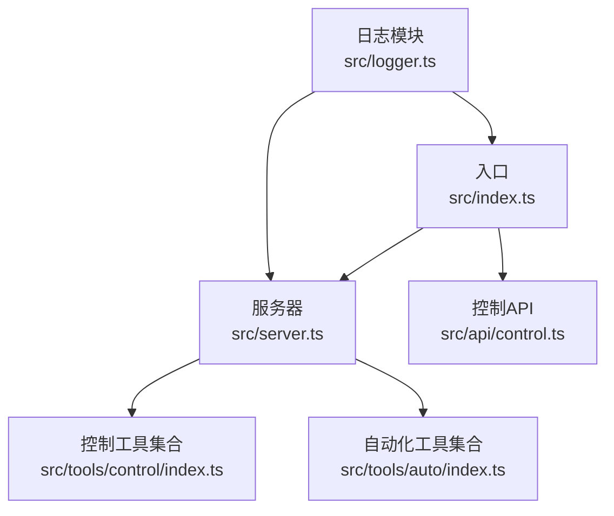
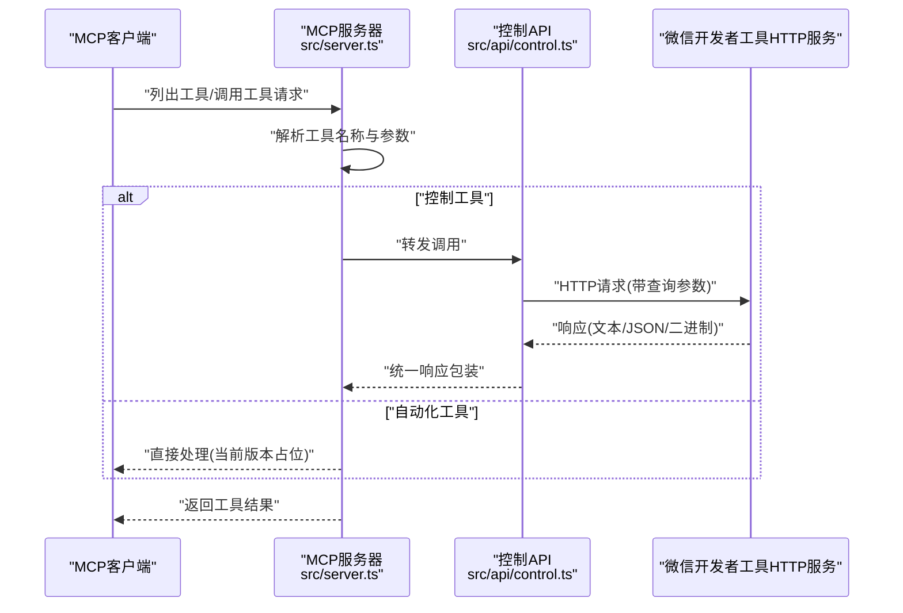
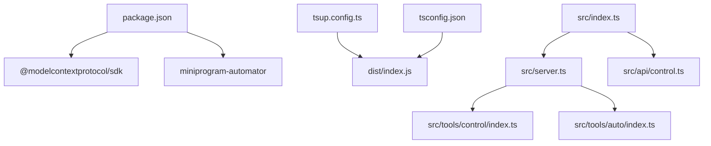

# 工具API

<cite>
**本文引用的文件**
- [src/index.ts](file://src/index.ts)
- [src/server.ts](file://src/server.ts)
- [src/api/control.ts](file://src/api/control.ts)
- [src/tools/control/index.ts](file://src/tools/control/index.ts)
- [src/tools/auto/index.ts](file://src/tools/auto/index.ts)
- [src/logger.ts](file://src/logger.ts)
- [package.json](file://package.json)
- [README.md](file://README.md)
- [tsup.config.ts](file://tsup.config.ts)
- [tsconfig.json](file://tsconfig.json)
- [src/api/control.test.ts](file://src/api/control.test.ts)
- [src/tools/control/index.test.ts](file://src/tools/control/index.test.ts)
- [src/tools/auto/index.test.ts](file://src/tools/auto/index.test.ts)
</cite>

## 目录
1. [简介](#简介)
2. [项目结构](#项目结构)
3. [核心组件](#核心组件)
4. [架构总览](#架构总览)
5. [详细组件分析](#详细组件分析)
6. [依赖关系分析](#依赖关系分析)
7. [性能与可靠性](#性能与可靠性)
8. [故障排查指南](#故障排查指南)
9. [结论](#结论)
10. [附录](#附录)

## 简介
本项目为“微信小程序 MCP 服务器”，通过 MCP 协议对外暴露两类工具集：
- 控制工具（control）：对接微信开发者工具 HTTP 控制接口，实现登录、预览、上传、构建、缓存清理、文件监控重置等项目管理与调试控制能力。
- 自动化工具（auto）：面向小程序自动化测试与交互，提供连接、页面导航、截图等基础能力（当前版本仅包含占位实现，后续可扩展）。

该文档系统性梳理两类工具API的功能、参数、返回值、异常处理策略，并给出环境变量、命令行与配置选项、典型使用场景与集成方式，帮助开发者在实际项目中高效应用。

## 项目结构
项目采用按职责分层的组织方式：
- 入口与启动：入口负责读取环境变量、初始化控制API、启动 MCP 服务器。
- 服务器：基于 MCP SDK，注册工具列表与调用处理器。
- 控制API：封装对微信开发者工具 HTTP 接口的请求与响应解析。
- 控制工具：将 HTTP 接口映射为 MCP 工具，统一输入输出格式。
- 自动化工具：预留自动化能力的工具集合。
- 日志：统一日志输出与级别控制。

图表来源
- [src/index.ts:1-33](file://src/index.ts#L1-L33)
- [src/server.ts:14-71](file://src/server.ts#L14-L71)
- [src/api/control.ts:14-85](file://src/api/control.ts#L14-L85)
- [src/tools/control/index.ts:40-326](file://src/tools/control/index.ts#L40-L326)
- [src/tools/auto/index.ts:8-22](file://src/tools/auto/index.ts#L8-L22)
- [src/logger.ts:19-24](file://src/logger.ts#L19-L24)

章节来源
- [src/index.ts:1-33](file://src/index.ts#L1-L33)
- [src/server.ts:14-71](file://src/server.ts#L14-L71)
- [src/logger.ts:19-24](file://src/logger.ts#L19-L24)

## 核心组件
- 控制API（Control API）
  - 功能：封装对本地微信开发者工具 HTTP 服务的请求，自动识别响应类型（文本、JSON、二进制），并支持超时与错误处理。
  - 关键接口：初始化配置、调用控制API、获取默认项目路径。
  - 返回值：统一的响应包装对象，包含类型与数据。
- 控制工具（Control Tools）
  - 功能：将 HTTP 控制接口映射为 MCP 工具，支持项目路径解析、默认值注入、二进制图片输出等。
  - 工具清单：登录、是否登录、预览、上传、自动预览、打开、关闭、退出、构建npm、重置文件工具、清除缓存等。
- 自动化工具（Auto Tools）
  - 功能：当前版本提供连接与页面导航占位实现，后续可扩展为完整的自动化测试与交互能力。
  - 工具清单：连接、导航等。
- 服务器（MCP Server）
  - 功能：注册工具列表、处理工具调用请求，统一日志输出。
- 日志（Logger）
  - 功能：按环境变量控制日志级别，输出到标准错误流。

章节来源
- [src/api/control.ts:14-85](file://src/api/control.ts#L14-L85)
- [src/tools/control/index.ts:40-326](file://src/tools/control/index.ts#L40-L326)
- [src/tools/auto/index.ts:8-22](file://src/tools/auto/index.ts#L8-L22)
- [src/server.ts:14-71](file://src/server.ts#L14-L71)
- [src/logger.ts:19-24](file://src/logger.ts#L19-L24)

## 架构总览
下图展示从 MCP 客户端发起工具调用到微信开发者工具 HTTP 服务的完整流程，以及服务器对两类工具的路由与处理逻辑。

图表来源
- [src/server.ts:40-60](file://src/server.ts#L40-L60)
- [src/api/control.ts:29-84](file://src/api/control.ts#L29-L84)

## 详细组件分析

### 控制API（Control API）
- 初始化与配置
  - 支持传入端口、超时、默认项目路径。
  - 提供获取默认项目路径的辅助方法。
- 请求与响应处理
  - 自动拼接查询参数，支持空值过滤。
  - 基于响应头 Content-Type 自动判断类型：
    - application/json → JSON 类型响应。
    - image/* 或 application/octet-stream → 二进制类型响应（自动转为 base64 字符串与 MIME 类型）。
    - 其他 → 文本类型响应。
  - 超时控制：基于 AbortController 实现请求超时。
  - 错误处理：HTTP 非 OK 状态抛出带状态码与消息的错误；网络超时抛出超时错误；其他连接错误统一包装。
- 异常策略
  - 未初始化：调用前必须先初始化，否则抛出明确错误。
  - 超时：抛出超时错误。
  - 连接失败：抛出连接失败错误。
  - HTTP 错误：抛出包含状态码与响应体的错误。

章节来源
- [src/api/control.ts:14-85](file://src/api/control.ts#L14-L85)
- [src/api/control.test.ts:9-122](file://src/api/control.test.ts#L9-L122)

### 控制工具（Control Tools）
- 统一输出格式
  - 文本响应：包装为 MCP 内容数组，类型为 text。
  - JSON 响应：序列化为字符串后以 text 类型返回。
  - 二进制响应：包装为 image 类型，包含 base64 数据与 MIME 类型。
- 项目路径解析
  - 若未显式提供 project 参数，则尝试使用默认项目路径（来自初始化配置或环境变量）。
  - 显式参数优先级更高。
- 工具清单与行为要点
  - 登录（wechat_control_login）
    - 默认二维码格式为 base64，便于 MCP 传输。
    - 支持将二维码写入文件与登录结果写入文件。
  - 是否登录（wechat_control_islogin）
    - 返回 JSON 结构的登录状态。
  - 预览（wechat_control_preview）
    - 支持多种二维码输出格式：image（PNG）、base64、terminal。
    - 支持将预览信息写入文件。
    - 当 qr-format 为 image 时，直接返回二进制 PNG。
  - 上传（wechat_control_upload）
    - 必需参数：version。
    - 支持将上传信息写入文件。
  - 自动预览（wechat_control_autopreview）
    - 在已连接设备上自动预览。
  - 构建 npm（wechat_control_buildnpm）
    - 支持指定编译类型（miniprogram/plugin）。
  - 打开/关闭/退出（wechat_control_open、wechat_control_close、wechat_control_quit）
    - 打开/关闭支持项目路径解析；退出无需参数。
  - 重置文件工具（wechat_control_resetfileutils）
    - 重置文件监听与监控。
  - 清除缓存（wechat_control_cleancache）
    - 支持多种缓存类型：storage、file、session、auth、network、compile、all。
- 输入校验与错误
  - 对于需要 project 的工具，若未提供且无默认值，抛出明确错误。
  - 对于必填参数（如 version），缺失时抛出错误。

章节来源
- [src/tools/control/index.ts:10-326](file://src/tools/control/index.ts#L10-L326)
- [src/tools/control/index.test.ts:10-184](file://src/tools/control/index.test.ts#L10-L184)

### 自动化工具（Auto Tools）
- 当前实现
  - 连接（wechat_auto_connect）：返回“已连接”提示。
  - 导航（wechat_auto_navigate）：接收 path 参数，返回“已导航”提示。
- 扩展建议
  - 后续可接入小程序自动化库，实现页面数据获取/设置、组件选择与点击、截图、模拟器尺寸调整等能力。

章节来源
- [src/tools/auto/index.ts:8-22](file://src/tools/auto/index.ts#L8-L22)
- [src/tools/auto/index.test.ts:4-16](file://src/tools/auto/index.test.ts#L4-L16)

### 服务器（MCP Server）
- 工具注册
  - 合并控制工具与自动化工具，统一暴露给 MCP 客户端。
- 请求处理
  - 列表工具：返回工具清单。
  - 调用工具：根据名称路由到对应工具处理器，未知工具抛错。
- 日志
  - 统一记录工具列表与调用日志，便于调试。

章节来源
- [src/server.ts:27-60](file://src/server.ts#L27-L60)

### 日志（Logger）
- 级别控制：通过环境变量 LOG_LEVEL 控制输出级别（DEBUG/INFO/ERROR）。
- 输出：统一写入标准错误流，包含时间戳与级别。

章节来源
- [src/logger.ts:3-24](file://src/logger.ts#L3-L24)

## 依赖关系分析
- 运行时依赖
  - @modelcontextprotocol/sdk：MCP 协议实现。
  - miniprogram-automator：小程序自动化能力（当前版本未在工具中直接使用，保留扩展空间）。
- 构建与打包
  - tsup：ESM 打包，生成可执行入口。
  - TypeScript：NodeNext 模块解析，目标 ES2022。
- 命令行与环境变量
  - bin 配置：全局命令 wechat-miniprogram-mcp 指向 dist/index.js。
  - 环境变量：WECHAT_DEVTOOLS_PORT（必需）、WECHAT_DEVTOOLS_CLI_PATH（可选，自动化 API 需要）、WECHAT_PROJECT_PATH（可选，控制 API 默认项目路径）、LOG_LEVEL（可选）。

图表来源
- [package.json:34-43](file://package.json#L34-L43)
- [tsup.config.ts:3-16](file://tsup.config.ts#L3-L16)
- [tsconfig.json:2-18](file://tsconfig.json#L2-L18)
- [src/index.ts:1-33](file://src/index.ts#L1-L33)
- [src/server.ts:14-71](file://src/server.ts#L14-L71)
- [src/api/control.ts:14-85](file://src/api/control.ts#L14-L85)
- [src/tools/control/index.ts:40-326](file://src/tools/control/index.ts#L40-L326)
- [src/tools/auto/index.ts:8-22](file://src/tools/auto/index.ts#L8-L22)

章节来源
- [package.json:34-43](file://package.json#L34-L43)
- [tsup.config.ts:3-16](file://tsup.config.ts#L3-L16)
- [tsconfig.json:2-18](file://tsconfig.json#L2-L18)

## 性能与可靠性
- 超时控制
  - 控制API请求超时由 AbortController 实现，避免阻塞。
  - 入口处分别配置控制超时与自动化超时，确保不同阶段的稳定性。
- 响应解析
  - 二进制响应自动进行 base64 编码，减少大文件传输开销。
- 日志级别
  - 通过 LOG_LEVEL 控制日志输出，生产环境建议设置为 INFO 或 ERROR，降低 IO 压力。
- 并发与资源
  - 工具调用为单次请求，不维护长连接；建议在 MCP 客户端侧进行并发控制与重试策略。

章节来源
- [src/api/control.ts:48-84](file://src/api/control.ts#L48-L84)
- [src/index.ts:5-7](file://src/index.ts#L5-L7)
- [src/logger.ts:3-9](file://src/logger.ts#L3-L9)

## 故障排查指南
- 环境变量未设置
  - WECHAT_DEVTOOLS_PORT 未设置会导致进程直接退出并输出错误日志。
  - 解决：在 MCP 客户端配置中设置 WECHAT_DEVTOOLS_PORT，并确保开发者工具已开启服务端口。
- 项目路径问题
  - 对于需要 project 的工具，若既未提供参数也未设置默认路径，会抛出“项目路径必填”的错误。
  - 解决：在工具参数中显式提供 project，或设置 WECHAT_PROJECT_PATH。
- HTTP 错误
  - 控制API对非 OK 响应会抛出包含状态码与响应体的错误，便于定位问题。
  - 解决：检查开发者工具端口、项目配置、权限与网络连通性。
- 超时错误
  - 若请求超过配置的超时时间，会抛出超时错误。
  - 解决：适当增大超时配置或优化网络环境。
- 日志定位
  - 使用 LOG_LEVEL 调整日志级别，结合服务器与入口的日志输出定位问题。

章节来源
- [src/index.ts:10-19](file://src/index.ts#L10-L19)
- [src/tools/control/index.ts:34-38](file://src/tools/control/index.ts#L34-L38)
- [src/api/control.ts:59-83](file://src/api/control.ts#L59-L83)
- [src/logger.ts:19-24](file://src/logger.ts#L19-L24)

## 结论
本项目通过 MCP 协议将微信开发者工具的 HTTP 控制接口与自动化能力抽象为标准化工具集，覆盖项目管理、调试控制、文件操作、自动化测试与批量操作等关键场景。控制工具已具备完善的参数解析、响应类型识别与错误处理机制；自动化工具当前提供占位实现，为后续扩展奠定基础。配合清晰的环境变量与日志配置，开发者可在各类 AI/MCP 客户端中快速集成并落地自动化工作流。

## 附录

### 环境变量与命令行
- 环境变量
  - WECHAT_DEVTOOLS_PORT：微信开发者工具 HTTP 服务端口（必需）。
  - WECHAT_DEVTOOLS_CLI_PATH：开发者工具 CLI 路径（可选，自动化 API 需要）。
  - WECHAT_PROJECT_PATH：小程序项目路径（可选，作为控制工具默认项目路径）。
  - LOG_LEVEL：日志级别（DEBUG/INFO/ERROR，默认 INFO）。
- 命令行
  - 全局安装后可通过 wechat-miniprogram-mcp 命令启动 MCP 服务器。
  - 构建与开发脚本见 package.json 中的 scripts。

章节来源
- [README.md:13-21](file://README.md#L13-L21)
- [package.json:14-21](file://package.json#L14-L21)
- [src/index.ts:5-21](file://src/index.ts#L5-L21)

### 工具清单与参数规范

- 控制工具（control）
  - wechat_control_login
    - 描述：登录微信开发者工具，返回二维码以便扫码登录。
    - 参数：
      - qr-format：二维码格式，可选 image/base64/terminal，默认 base64。
      - qr-output：二维码输出文件路径。
      - result-output：登录结果 JSON 文件路径。
    - 返回：MCP 内容数组，text 或 image。
  - wechat_control_islogin
    - 描述：检查是否已登录。
    - 参数：无。
    - 返回：MCP 内容数组，text（JSON 字符串）。
  - wechat_control_preview
    - 描述：生成项目预览二维码。
    - 参数：
      - project：项目路径（可选，优先使用参数，其次默认路径）。
      - qr-format：二维码格式，可选 image/base64/terminal，默认 base64。
      - qr-output：二维码输出文件路径。
      - info-output：预览信息 JSON 文件路径。
      - compile-condition：自定义编译条件（JSON 字符串）。
    - 返回：MCP 内容数组，text 或 image。
  - wechat_control_upload
    - 描述：上传项目代码。
    - 参数：
      - project：项目路径（可选）。
      - version：版本号（必填）。
      - desc：描述/备注。
      - info-output：上传信息 JSON 文件路径。
    - 返回：MCP 内容数组，text。
  - wechat_control_autopreview
    - 描述：在已连接设备上自动预览。
    - 参数：
      - project：项目路径（可选）。
      - info-output：预览信息 JSON 文件路径。
    - 返回：MCP 内容数组，text。
  - wechat_control_buildnpm
    - 描述：构建项目 npm 包。
    - 参数：
      - project：项目路径（可选）。
      - compile-type：编译类型，可选 miniprogram/plugin。
    - 返回：MCP 内容数组，text。
  - wechat_control_open
    - 描述：打开开发者工具或指定项目。
    - 参数：
      - project：项目路径（可选）。
    - 返回：MCP 内容数组，text。
  - wechat_control_close
    - 描述：关闭开发者工具中的项目窗口。
    - 参数：
      - project：项目路径（可选）。
    - 返回：MCP 内容数组，text。
  - wechat_control_quit
    - 描述：退出开发者工具。
    - 参数：无。
    - 返回：MCP 内容数组，text。
  - wechat_control_resetfileutils
    - 描述：重置文件监听与监控。
    - 参数：
      - project：项目路径（可选）。
    - 返回：MCP 内容数组，text。
  - wechat_control_cleancache
    - 描述：清除项目缓存。
    - 参数：
      - project：项目路径（可选）。
      - clean：缓存类型，可选 storage/file/session/auth/network/compile/all。
    - 返回：MCP 内容数组，text。

- 自动化工具（auto）
  - wechat_auto_connect
    - 描述：连接自动化工具。
    - 参数：无。
    - 返回：MCP 内容数组，text。
  - wechat_auto_navigate
    - 描述：导航到指定页面。
    - 参数：path（必填）。
    - 返回：MCP 内容数组，text。

章节来源
- [src/tools/control/index.ts:40-326](file://src/tools/control/index.ts#L40-L326)
- [src/tools/auto/index.ts:8-22](file://src/tools/auto/index.ts#L8-L22)

### 典型使用场景与集成方式
- 在 MCP 客户端中配置 MCP 服务器
  - 在客户端配置文件中添加 mcpServers，指定 command 为 wechat-miniprogram-mcp，并设置 WECHAT_DEVTOOLS_PORT、WECHAT_DEVTOOLS_CLI_PATH、WECHAT_PROJECT_PATH 等环境变量。
- 场景示例
  - 自动化登录与预览：调用 wechat_control_login 获取二维码，扫码登录后调用 wechat_control_preview 生成预览二维码。
  - 自动上传：调用 wechat_control_upload 上传指定版本代码。
  - 自动化测试准备：调用 wechat_auto_connect 建立连接，随后调用 wechat_auto_navigate 进行页面跳转。
- 注意事项
  - 确保开发者工具已开启服务端口并正确配置端口。
  - 对于需要 project 的工具，务必提供项目路径或设置默认路径。
  - 根据网络状况合理设置超时时间，避免频繁超时。

章节来源
- [README.md:28-45](file://README.md#L28-L45)
- [src/index.ts:21-30](file://src/index.ts#L21-L30)