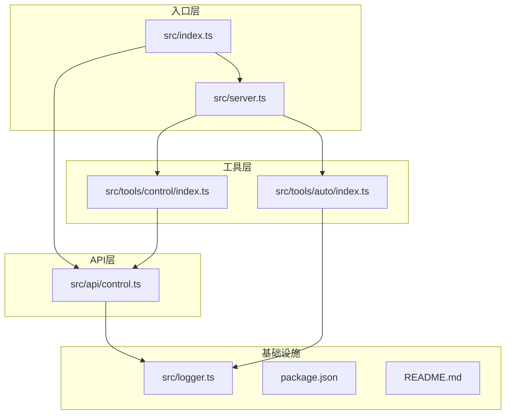
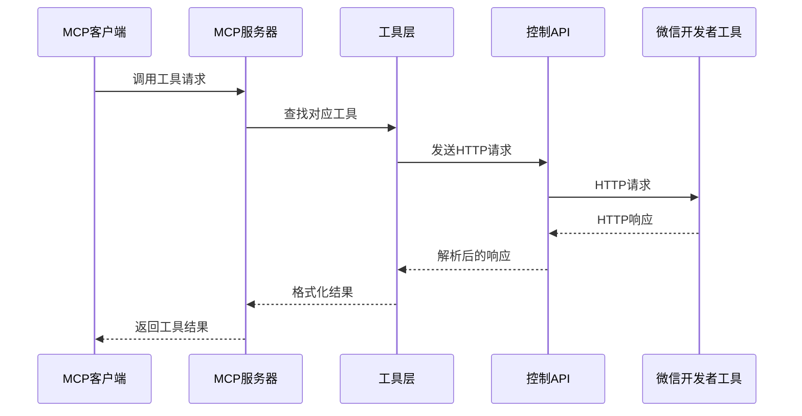
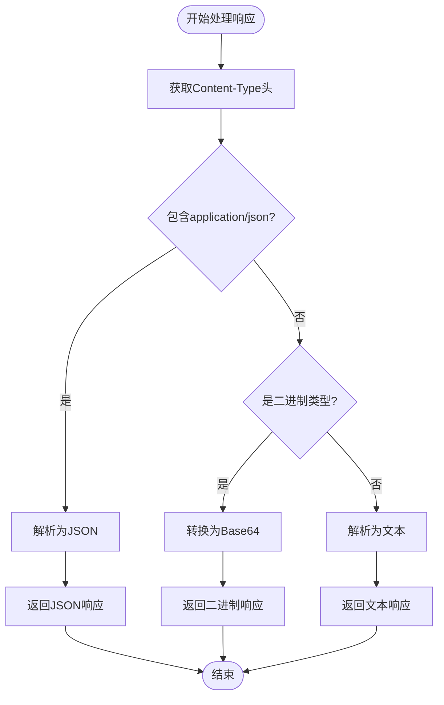
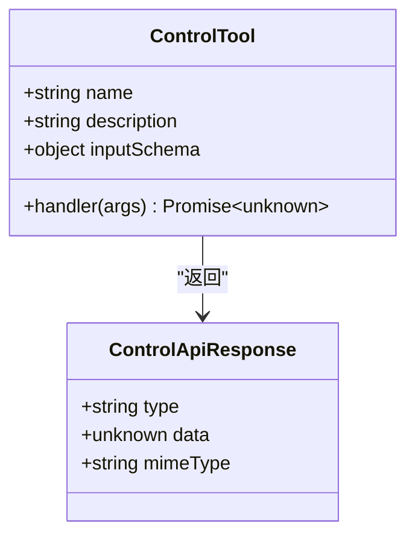
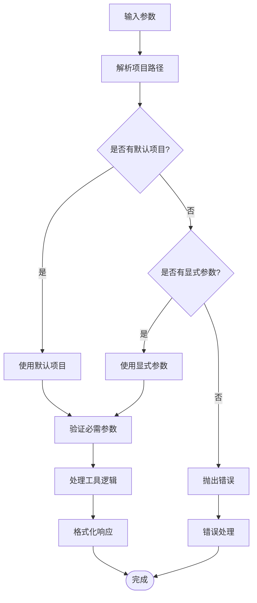
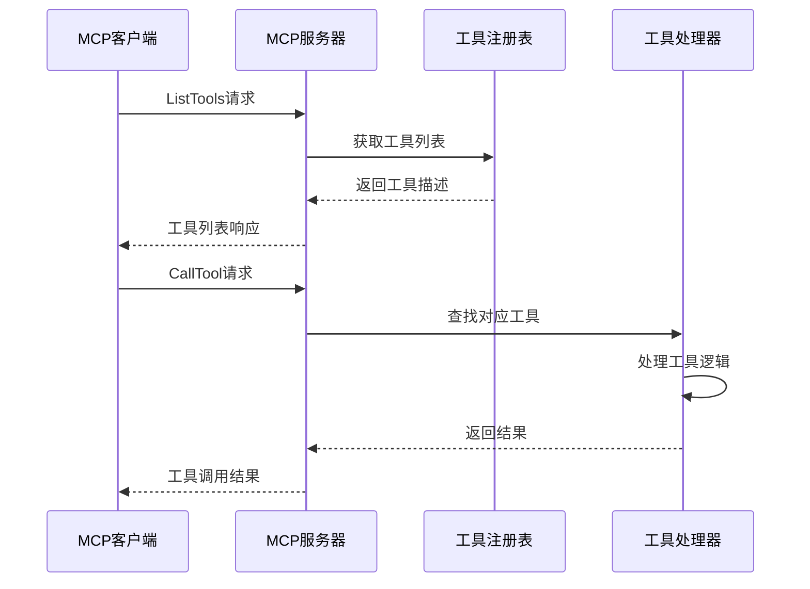

# 控制API

<cite>
**本文档引用的文件**
- [src/api/control.ts](file://src/api/control.ts)
- [src/tools/control/index.ts](file://src/tools/control/index.ts)
- [src/index.ts](file://src/index.ts)
- [src/server.ts](file://src/server.ts)
- [src/logger.ts](file://src/logger.ts)
- [src/api/control.test.ts](file://src/api/control.test.ts)
- [src/tools/control/index.test.ts](file://src/tools/control/index.test.ts)
- [src/integration.test.ts](file://src/integration.test.ts)
- [README.md](file://README.md)
- [package.json](file://package.json)
</cite>

## 目录
1. [简介](#简介)
2. [项目结构](#项目结构)
3. [核心组件](#核心组件)
4. [架构概览](#架构概览)
5. [详细组件分析](#详细组件分析)
6. [依赖关系分析](#依赖关系分析)
7. [性能考虑](#性能考虑)
8. [故障排除指南](#故障排除指南)
9. [结论](#结论)
10. [附录](#附录)

## 简介

本项目是一个为微信开发者工具提供MCP（Model Context Protocol）服务器的Node.js应用程序。它通过HTTP API与微信开发者工具进行交互，实现了小程序开发的自动化操作。控制API是该系统的核心组件，提供了对微信开发者工具HTTP服务的封装，支持多种HTTP方法和响应类型的智能处理。

该项目的主要目标是：
- 提供与微信开发者工具的HTTP API集成
- 实现小程序开发流程的自动化
- 支持MCP协议，便于AI代理与开发者工具的交互
- 提供完整的错误处理和超时管理机制

## 项目结构

项目采用模块化的架构设计，主要分为以下几个核心部分：



**图表来源**
- [src/index.ts:1-33](file://src/index.ts#L1-L33)
- [src/server.ts:1-71](file://src/server.ts#L1-L71)
- [src/api/control.ts:1-85](file://src/api/control.ts#L1-L85)
- [src/tools/control/index.ts:1-326](file://src/tools/control/index.ts#L1-L326)

**章节来源**
- [src/index.ts:1-33](file://src/index.ts#L1-L33)
- [src/server.ts:1-71](file://src/server.ts#L1-L71)
- [package.json:1-48](file://package.json#L1-L48)

## 核心组件

### 控制API配置接口

控制API的核心配置通过`ControlApiConfig`接口定义，包含以下关键属性：

- **port**: number - 微信开发者工具HTTP服务的端口号
- **timeout**: number - 请求超时时间（秒）
- **projectPath**: string? - 默认项目路径，可选

### 响应数据类型

系统支持三种响应类型，通过`ControlApiResponse`联合类型表示：

- **text**: 文本响应，适用于普通字符串或状态信息
- **json**: JSON响应，适用于结构化数据
- **binary**: 二进制响应，适用于图片等多媒体数据

### 初始化配置函数

`initControlApi`函数负责初始化控制API配置，接受用户提供的配置对象并存储为全局配置。

**章节来源**
- [src/api/control.ts:1-16](file://src/api/control.ts#L1-L16)

## 架构概览

系统采用分层架构设计，从上到下分别为：MCP服务器层、工具层、API层和微信开发者工具层。



**图表来源**
- [src/server.ts:45-60](file://src/server.ts#L45-L60)
- [src/tools/control/index.ts:63-81](file://src/tools/control/index.ts#L63-L81)
- [src/api/control.ts:29-84](file://src/api/control.ts#L29-L84)

## 详细组件分析

### 控制API核心实现

#### 初始化配置 (`initControlApi`)

该函数负责设置全局控制API配置，包括端口、超时时间和默认项目路径。

**参数:**
- `userConfig`: ControlApiConfig - 用户提供的配置对象

**功能:**
- 存储配置到全局变量
- 为后续API调用提供基础配置

**章节来源**
- [src/api/control.ts:14-16](file://src/api/control.ts#L14-L16)

#### 默认项目获取 (`getDefaultProject`)

获取已配置的默认项目路径。

**返回值:** string | undefined - 默认项目路径或未定义

**章节来源**
- [src/api/control.ts:18-20](file://src/api/control.ts#L18-L20)

#### 通用调用函数 (`callControlApi`)

这是控制API的核心函数，负责与微信开发者工具进行HTTP通信。

**函数签名:**
```typescript
async function callControlApi(
  method: string,
  path: string,
  params?: Record<string, unknown>
): Promise<ControlApiResponse>
```

**参数:**
- `method`: string - HTTP方法（GET、POST等）
- `path`: string - API路径
- `params`: Record<string, unknown>? - 查询参数

**返回值:** ControlApiResponse - 统一的响应格式

**处理逻辑:**

1. **配置验证**: 检查是否已初始化配置
2. **URL构建**: 使用`http://127.0.0.1:{port}`作为基础URL
3. **参数处理**: 将参数转换为查询字符串
4. **超时控制**: 使用AbortController实现请求超时
5. **响应处理**: 根据Content-Type自动识别响应类型

**章节来源**
- [src/api/control.ts:29-84](file://src/api/control.ts#L29-L84)

#### 内容类型检测

系统实现了智能的内容类型检测机制：



**图表来源**
- [src/api/control.ts:64-76](file://src/api/control.ts#L64-L76)

**章节来源**
- [src/api/control.ts:22-27](file://src/api/control.ts#L22-L27)

### 控制工具集

系统提供了11个完整的控制工具，每个工具都遵循统一的接口规范。

#### 工具接口定义



**图表来源**
- [src/tools/control/index.ts:3-8](file://src/tools/control/index.ts#L3-L8)
- [src/api/control.ts:7-10](file://src/api/control.ts#L7-L10)

#### 工具分类

##### 基础操作类
- `wechat_control_login`: 登录微信开发者工具
- `wechat_control_islogin`: 检查登录状态
- `wechat_control_quit`: 退出开发者工具

##### 项目管理类
- `wechat_control_open`: 打开项目
- `wechat_control_close`: 关闭项目窗口
- `wechat_control_preview`: 生成预览二维码
- `wechat_control_autopreview`: 自动预览到设备

##### 代码管理类
- `wechat_control_upload`: 上传代码
- `wechat_control_buildnpm`: 构建npm包

##### 缓存管理类
- `wechat_control_cleancache`: 清除缓存
- `wechat_control_resetfileutils`: 重置文件监控

**章节来源**
- [src/tools/control/index.ts:40-325](file://src/tools/control/index.ts#L40-L325)

#### 工具参数处理

系统实现了智能的参数处理机制：



**图表来源**
- [src/tools/control/index.ts:23-38](file://src/tools/control/index.ts#L23-L38)

**章节来源**
- [src/tools/control/index.ts:23-38](file://src/tools/control/index.ts#L23-L38)

### MCP服务器集成

系统通过MCP协议与AI代理进行交互，实现了标准的工具注册和调用机制。



**图表来源**
- [src/server.ts:40-60](file://src/server.ts#L40-L60)

**章节来源**
- [src/server.ts:14-70](file://src/server.ts#L14-L70)

## 依赖关系分析

系统采用松耦合的设计，各模块之间的依赖关系清晰明确。

```mermaid
graph TB
subgraph "外部依赖"
A[@modelcontextprotocol/sdk]
B[miniprogram-automator]
end
subgraph "内部模块"
C[src/index.ts]
D[src/server.ts]
E[src/api/control.ts]
F[src/tools/control/index.ts]
G[src/logger.ts]
end
C --> E
C --> D
D --> F
D --> G
F --> E
E --> G
A -.-> D
B -.-> F
```

**图表来源**
- [package.json:34-43](file://package.json#L34-L43)
- [src/index.ts:1-4](file://src/index.ts#L1-L4)

**章节来源**
- [package.json:34-43](file://package.json#L34-L43)

### 主要依赖项

- **@modelcontextprotocol/sdk**: 提供MCP协议实现
- **miniprogram-automator**: 支持自动化API功能
- **Node.js内置模块**: 使用fetch API进行HTTP请求

## 性能考虑

### 超时机制

系统实现了多层次的超时保护机制：

1. **请求超时**: 通过AbortController实现精确的超时控制
2. **连接超时**: 防止长时间阻塞导致的资源浪费
3. **日志级别**: 支持DEBUG/INFO/ERROR级别的日志输出控制

### 内存优化

- **流式处理**: 对于大文件下载采用流式处理方式
- **及时释放**: 在请求完成后及时清理超时定时器
- **响应类型优化**: 根据Content-Type选择最优的解析策略

### 并发处理

系统支持并发的工具调用，但需要注意：
- 每个工具调用都有独立的超时控制
- 共享的网络连接可能成为瓶颈
- 建议合理设置超时时间和并发数量

## 故障排除指南

### 常见错误类型

#### 配置错误

**问题**: `Control API not initialized`
**原因**: 未调用`initControlApi`函数
**解决方案**: 确保在使用任何API之前先初始化配置

#### 网络连接错误

**问题**: `Failed to connect to WeChat DevTools`
**原因**: 开发者工具未启动或端口不正确
**解决方案**: 
1. 确认微信开发者工具已启动
2. 检查WECHAT_DEVTOOLS_PORT环境变量
3. 验证端口是否正确开放

#### 超时错误

**问题**: `Request timeout`
**原因**: 请求超过配置的超时时间
**解决方案**:
1. 增加timeout配置
2. 检查网络连接质量
3. 减少同时进行的请求数量

#### HTTP错误

**问题**: `HTTP {status}: {message}`
**原因**: 开发者工具返回了错误状态码
**解决方案**:
1. 检查请求参数是否正确
2. 验证项目路径是否存在
3. 确认开发者工具版本兼容性

### 调试技巧

#### 启用详细日志

设置`LOG_LEVEL=DEBUG`环境变量以获取详细的调试信息。

#### 环境变量检查

确保以下环境变量正确设置：
- `WECHAT_DEVTOOLS_PORT`: 开发者工具HTTP服务端口
- `WECHAT_PROJECT_PATH`: 小程序项目路径
- `WECHAT_DEVTOOLS_CLI_PATH`: CLI路径（自动化API需要）

**章节来源**
- [src/api/control.ts:77-83](file://src/api/control.ts#L77-L83)
- [src/index.ts:5-19](file://src/index.ts#L5-L19)

## 结论

本项目成功实现了微信开发者工具与MCP协议的完整集成，提供了稳定可靠的控制API。通过模块化的架构设计和完善的错误处理机制，系统能够满足各种小程序开发场景的需求。

主要优势包括：
- **完整的API覆盖**: 支持开发者工具的所有主要功能
- **智能响应处理**: 自动识别和处理不同类型的响应数据
- **灵活的配置选项**: 支持多种环境配置和参数设置
- **健壮的错误处理**: 提供详细的错误信息和恢复机制

建议的改进方向：
- 添加更多的单元测试覆盖
- 实现更精细的日志记录和监控
- 支持更多自定义的HTTP头部和认证方式
- 优化内存使用和性能表现

## 附录

### API使用示例

#### 基本配置

```javascript
// 初始化控制API
initControlApi({
  port: 60815,
  timeout: 30,
  projectPath: '/path/to/your/project'
});
```

#### 调用登录接口

```javascript
// 获取登录二维码
const result = await callControlApi('GET', '/v2/login', {
  'qr-format': 'base64',
  'qr-output': '/tmp/qrcode.png'
});
```

#### 预览项目

```javascript
// 生成预览二维码
const result = await callControlApi('GET', '/v2/preview', {
  project: '/path/to/your/project',
  'qr-format': 'base64'
});
```

### 环境变量配置

| 变量名 | 说明 | 必填 | 默认值 |
|--------|------|------|--------|
| `WECHAT_DEVTOOLS_PORT` | 开发者工具HTTP服务端口 | 是 | 无 |
| `WECHAT_DEVTOOLS_CLI_PATH` | CLI路径 | 否 | 无 |
| `WECHAT_PROJECT_PATH` | 项目路径 | 否 | 无 |
| `LOG_LEVEL` | 日志级别 | 否 | INFO |

### 支持的HTTP方法

- **GET**: 用于查询状态和获取数据
- **POST**: 用于提交数据和执行操作
- **PUT**: 用于更新配置
- **DELETE**: 用于删除资源

### 响应数据类型映射

| Content-Type | 响应类型 | 处理方式 |
|-------------|----------|----------|
| application/json | json | JSON.parse() |
| image/* | binary | Base64编码 |
| application/octet-stream | binary | Base64编码 |
| text/* | text | 直接返回 |
| 其他 | text | 字符串化 |