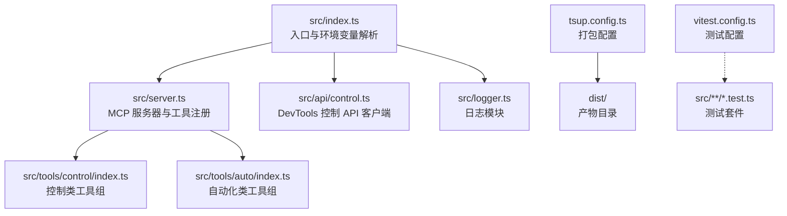
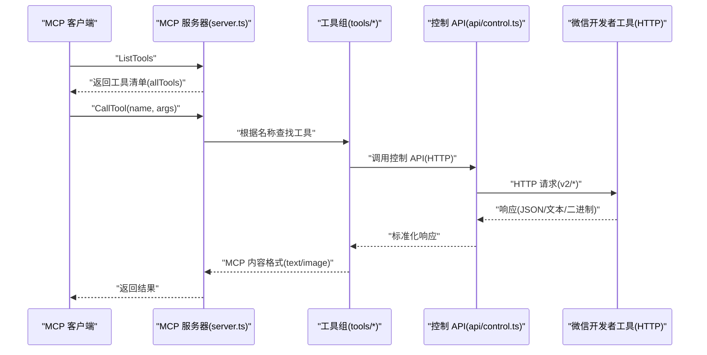
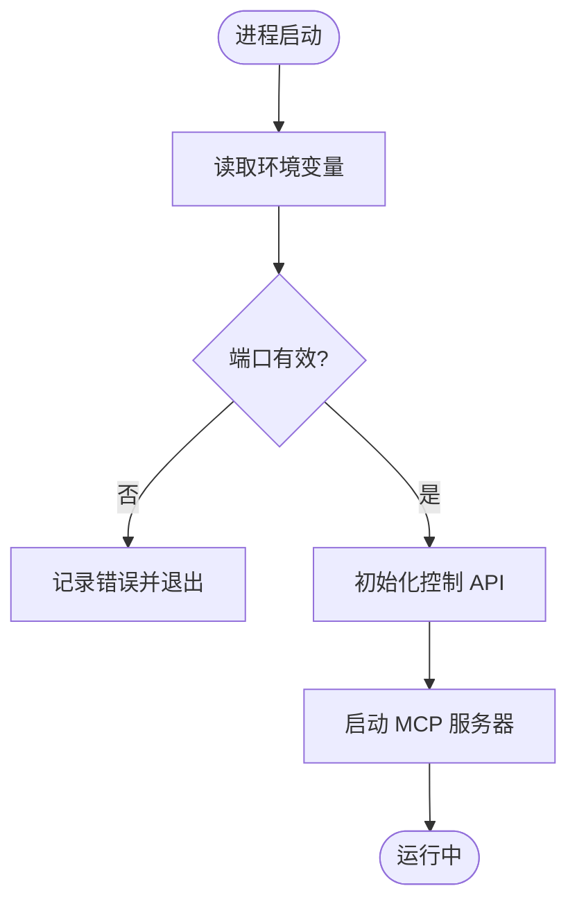
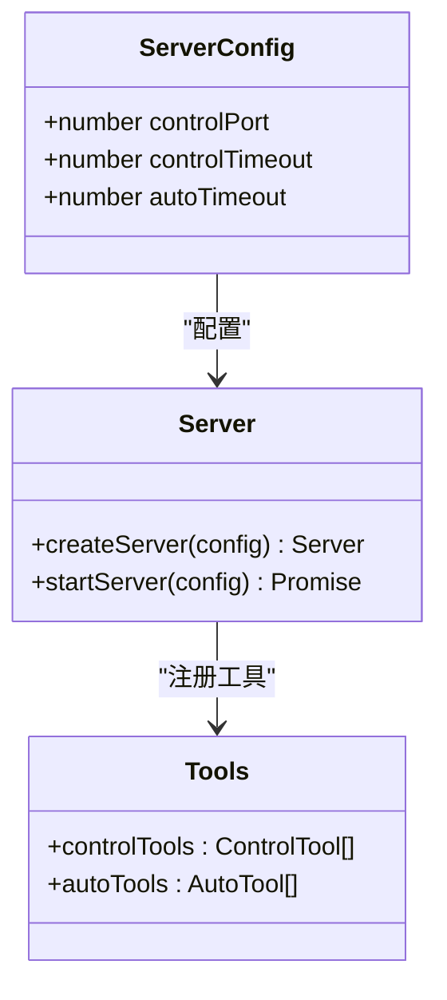
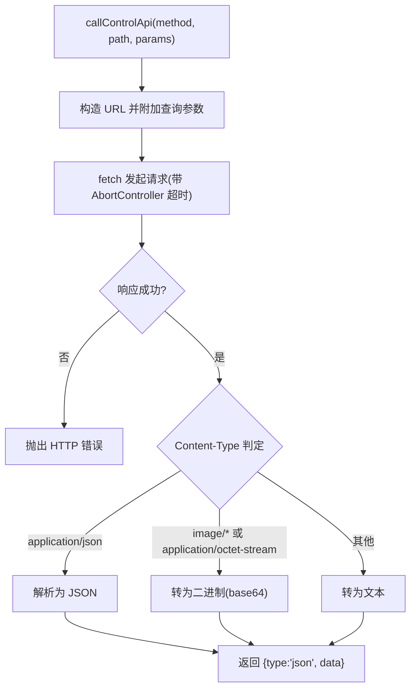
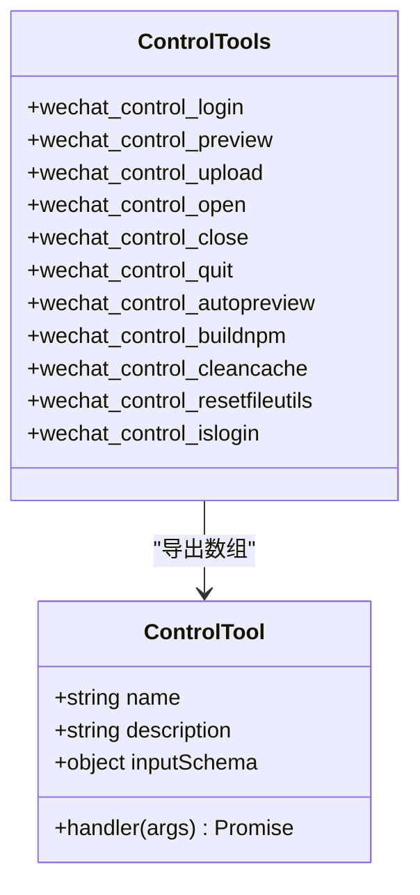
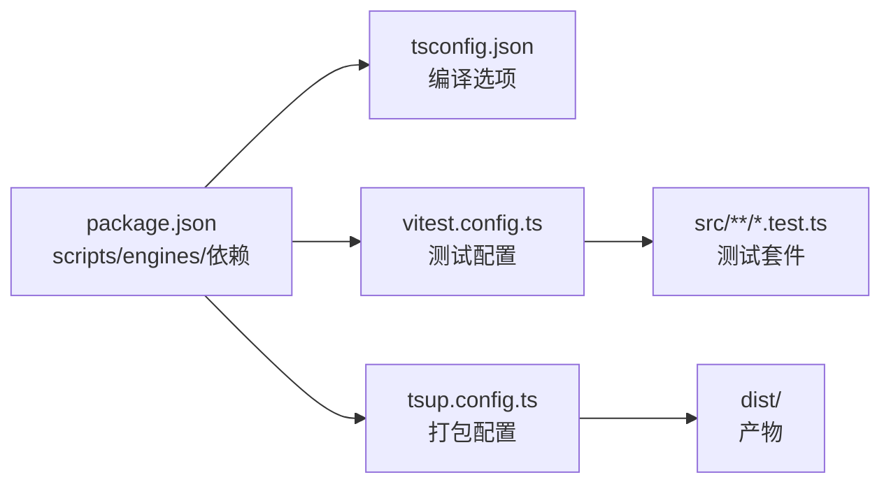

# 开发指南

<cite>
**本文引用的文件**
- [package.json](file://package.json)
- [tsconfig.json](file://tsconfig.json)
- [tsup.config.ts](file://tsup.config.ts)
- [vitest.config.ts](file://vitest.config.ts)
- [README.md](file://README.md)
- [AGENTS.md](file://AGENTS.md)
- [.github/workflows/publish.yml](file://.github/workflows/publish.yml)
- [scripts/check-shebang.js](file://scripts/check-shebang.js)
- [src/index.ts](file://src/index.ts)
- [src/server.ts](file://src/server.ts)
- [src/logger.ts](file://src/logger.ts)
- [src/api/control.ts](file://src/api/control.ts)
- [src/tools/control/index.ts](file://src/tools/control/index.ts)
- [src/tools/auto/index.ts](file://src/tools/auto/index.ts)
- [src/index.test.ts](file://src/index.test.ts)
- [src/api/control.test.ts](file://src/api/control.test.ts)
- [src/tools/control/index.test.ts](file://src/tools/control/index.test.ts)
- [src/tools/auto/index.test.ts](file://src/tools/auto/index.test.ts)
</cite>

## 目录
1. [简介](#简介)
2. [项目结构](#项目结构)
3. [核心组件](#核心组件)
4. [架构总览](#架构总览)
5. [详细组件分析](#详细组件分析)
6. [依赖关系分析](#依赖关系分析)
7. [性能考虑](#性能考虑)
8. [故障排查指南](#故障排查指南)
9. [结论](#结论)
10. [附录](#附录)

## 简介
本指南面向希望参与本项目的开发者，覆盖从环境准备、开发模式运行、构建与打包、测试策略到贡献与发布的完整流程。项目基于 TypeScript 与 Node.js，使用 tsup 进行打包，Vitest 进行单元测试，并通过 GitHub Actions 实现自动发布。

## 项目结构
项目采用按功能分层的组织方式：入口模块负责初始化控制 API 并启动 MCP 服务器；服务器模块注册两类工具组（控制类与自动化类），并通过 STDIO 传输协议与 MCP 客户端通信；日志模块统一输出；API 层封装对微信开发者工具 HTTP 接口的调用；工具层实现具体的业务能力。

图表来源
- [src/index.ts:1-33](file://src/index.ts#L1-L33)
- [src/server.ts:1-71](file://src/server.ts#L1-L71)
- [src/tools/control/index.ts:1-326](file://src/tools/control/index.ts#L1-L326)
- [src/tools/auto/index.ts:1-22](file://src/tools/auto/index.ts#L1-L22)
- [src/api/control.ts:1-85](file://src/api/control.ts#L1-L85)
- [src/logger.ts:1-24](file://src/logger.ts#L1-L24)
- [tsup.config.ts:1-17](file://tsup.config.ts#L1-L17)
- [vitest.config.ts:1-11](file://vitest.config.ts#L1-L11)

章节来源
- [package.json:14-21](file://package.json#L14-L21)
- [tsup.config.ts:1-17](file://tsup.config.ts#L1-L17)
- [vitest.config.ts:1-11](file://vitest.config.ts#L1-L11)

## 核心组件
- 入口与运行时
  - 读取环境变量并初始化控制 API，随后启动 MCP 服务器。
  - 提供错误处理与进程退出逻辑。
- MCP 服务器
  - 注册两类工具组，统一处理 ListTools 与 CallTool 请求。
  - 基于 STDIO 传输协议与 MCP 客户端交互。
- 控制 API 客户端
  - 统一封装 HTTP 请求，支持超时、二进制与文本响应类型识别。
  - 对二维码等二进制内容进行 base64 编码以适配 MCP 图像内容格式。
- 工具组
  - 控制类工具组：覆盖登录、预览、上传、打开/关闭项目、退出、自动预览、构建 npm、清理缓存、重置文件监控、检查登录状态等。
  - 自动化类工具组：当前为占位实现，预留后续扩展。
- 日志模块
  - 支持 DEBUG/INFO/ERROR 三个级别，受 LOG_LEVEL 环境变量控制。

章节来源
- [src/index.ts:1-33](file://src/index.ts#L1-L33)
- [src/server.ts:14-71](file://src/server.ts#L14-L71)
- [src/api/control.ts:14-85](file://src/api/control.ts#L14-L85)
- [src/tools/control/index.ts:40-326](file://src/tools/control/index.ts#L40-L326)
- [src/tools/auto/index.ts:8-22](file://src/tools/auto/index.ts#L8-L22)
- [src/logger.ts:19-24](file://src/logger.ts#L19-L24)

## 架构总览
下图展示了从 MCP 客户端发起请求到微信开发者工具 HTTP API 的完整链路，以及工具注册与分发机制。

图表来源
- [src/server.ts:27-60](file://src/server.ts#L27-L60)
- [src/tools/control/index.ts:10-19](file://src/tools/control/index.ts#L10-L19)
- [src/api/control.ts:29-84](file://src/api/control.ts#L29-L84)

## 详细组件分析

### 入口与环境变量解析
- 解析 WECHAT_DEVTOOLS_PORT、WECHAT_PROJECT_PATH 等环境变量。
- 初始化控制 API 并启动服务器，异常时记录错误并退出。

图表来源
- [src/index.ts:5-30](file://src/index.ts#L5-L30)

章节来源
- [src/index.ts:1-33](file://src/index.ts#L1-L33)

### MCP 服务器与工具注册
- 创建服务器实例并注册两类工具组，合并为 allTools。
- 处理 ListTools 返回工具清单；处理 CallTool 根据名称分发至对应工具。

图表来源
- [src/server.ts:8-12](file://src/server.ts#L8-L12)
- [src/server.ts:14-71](file://src/server.ts#L14-L71)
- [src/tools/control/index.ts:3-8](file://src/tools/control/index.ts#L3-L8)
- [src/tools/auto/index.ts:1-6](file://src/tools/auto/index.ts#L1-L6)

章节来源
- [src/server.ts:14-71](file://src/server.ts#L14-L71)

### 控制 API 客户端
- 统一构造 URL、设置查询参数、超时控制与错误处理。
- 根据 Content-Type 判定响应类型并转换为标准格式（text/json/binary）。

图表来源
- [src/api/control.ts:29-84](file://src/api/control.ts#L29-L84)

章节来源
- [src/api/control.ts:14-85](file://src/api/control.ts#L14-L85)

### 控制类工具组
- 提供登录、预览、上传、打开/关闭项目、退出、自动预览、构建 npm、清理缓存、重置文件监控、检查登录状态等工具。
- 对二维码等二进制响应进行适配，确保 MCP 客户端能正确展示图像。

图表来源
- [src/tools/control/index.ts:3-8](file://src/tools/control/index.ts#L3-L8)
- [src/tools/control/index.ts:40-326](file://src/tools/control/index.ts#L40-L326)

章节来源
- [src/tools/control/index.ts:40-326](file://src/tools/control/index.ts#L40-L326)

### 自动化类工具组
- 当前为占位实现，提供连接与导航等占位工具，便于后续扩展。

章节来源
- [src/tools/auto/index.ts:8-22](file://src/tools/auto/index.ts#L8-L22)

### 日志模块
- 通过 LOG_LEVEL 控制输出级别，统一写入标准错误流，便于与 MCP 客户端集成。

章节来源
- [src/logger.ts:19-24](file://src/logger.ts#L19-L24)

## 依赖关系分析
- 构建与打包
  - 使用 tsup 将 src/index.ts 打包为 ESM，目标平台为 Node 18，启用 SourceMap，注入 shebang 并在构建后校验。
- 测试
  - Vitest 在 Node 环境执行，包含所有 src/**/*.test.ts，排除集成测试文件。
- 运行时
  - 依赖 @modelcontextprotocol/sdk 与 miniprogram-automator，Node 版本要求 >= 18。

图表来源
- [package.json:14-46](file://package.json#L14-L46)
- [tsconfig.json:2-18](file://tsconfig.json#L2-L18)
- [vitest.config.ts:3-10](file://vitest.config.ts#L3-L10)
- [tsup.config.ts:3-16](file://tsup.config.ts#L3-L16)

章节来源
- [package.json:14-46](file://package.json#L14-L46)
- [tsup.config.ts:3-16](file://tsup.config.ts#L3-L16)
- [vitest.config.ts:3-10](file://vitest.config.ts#L3-L10)

## 性能考虑
- 构建与打包
  - 使用单入口与 ESM 输出，减少模块体积与加载时间。
  - 启用 SourceMap 便于调试，但注意生产环境可按需关闭。
  - noExternal 仅包含特定依赖，避免不必要的外部化导致的重复打包。
- 运行时
  - 控制 API 调用统一超时控制，避免阻塞；二进制响应统一转为 base64，降低客户端处理复杂度。
  - 日志级别可通过环境变量调整，避免在高并发场景下产生过多输出。
- 测试
  - 单测优先，集成测试单独排除，缩短默认测试时间；watch 模式适合快速迭代。

## 故障排查指南
- 环境变量缺失
  - 若未设置 WECHAT_DEVTOOLS_PORT，入口会记录错误并退出。请确认已开启微信开发者工具的“安全 -> 开启服务端口”并记录端口。
- 请求超时或连接失败
  - 控制 API 默认超时为 30 秒；若网络不稳定或 DevTools 无响应，将抛出超时错误。可适当提高超时或检查端口连通性。
- 二进制响应问题
  - 预览二维码等接口可能返回二进制数据，工具层会自动转换为 base64 图像内容；如需原始二进制，请在调用时指定相应参数。
- 构建产物校验失败
  - 打包后脚本会检查 shebang 行数，若存在多行 shebang 将报错并终止。请确保仅注入一次 shebang。
- 测试失败
  - 单测使用 Vitest 的全局 API；如需运行特定测试文件，可直接调用 Vitest CLI。集成测试默认不包含在 npm test 中，需要单独执行。

章节来源
- [src/index.ts:10-13](file://src/index.ts#L10-L13)
- [src/api/control.ts:48-83](file://src/api/control.ts#L48-L83)
- [scripts/check-shebang.js:13-19](file://scripts/check-shebang.js#L13-L19)
- [vitest.config.ts:7-8](file://vitest.config.ts#L7-L8)

## 结论
本项目提供了从微信开发者工具 HTTP API 到 MCP 客户端的完整桥接能力，具备清晰的模块划分、完善的测试与构建配置，以及可扩展的工具体系。遵循本文档的开发与贡献流程，可高效完成本地开发、测试与发布。

## 附录

### 开发环境搭建
- 系统要求
  - Node.js 版本满足 engines 字段要求。
- 安装依赖
  - 使用 npm install 安装依赖。
- 启动开发模式
  - 使用 npm run dev 进入监听模式，自动重新打包。
- 构建
  - 使用 npm run build 执行打包与 shebang 校验。
- 类型检查/Lint
  - 使用 npm run typecheck 进行类型检查（等价于 tsc --noEmit）。
- 测试
  - 使用 npm run test 运行全部单测；使用 npm run test:watch 进入监听模式。

章节来源
- [package.json:44-46](file://package.json#L44-L46)
- [package.json:14-20](file://package.json#L14-L20)
- [AGENTS.md:9-16](file://AGENTS.md#L9-L16)

### 开发模式运行
- 步骤
  - 安装依赖后执行 npm run dev。
  - 在 MCP 客户端中配置命令为已安装的全局可执行文件，传入必要的环境变量。
- 环境变量
  - WECHAT_DEVTOOLS_PORT：必填，DevTools HTTP 服务端口。
  - WECHAT_DEVTOOLS_CLI_PATH：可选，自动化 API 需要。
  - WECHAT_PROJECT_PATH：可选，作为默认项目路径。
  - LOG_LEVEL：可选，DEBUG/INFO/ERROR，默认 INFO。

章节来源
- [README.md:13-21](file://README.md#L13-L21)
- [src/index.ts:5-8](file://src/index.ts#L5-L8)

### TypeScript 配置
- 目标与模块系统
  - 目标 ES2022，模块与解析策略为 NodeNext，库包含 ES2022。
- 编译选项
  - 输出目录 dist，根目录 src，严格模式关闭，允许 esModuleInterop，跳过库检查，生成声明与 SourceMap。
- 包含与排除
  - 包含 src/**/*，排除 node_modules 与 dist。

章节来源
- [tsconfig.json:2-18](file://tsconfig.json#L2-L18)

### 打包配置
- 入口与输出
  - 入口为 src/index.ts，输出格式为 ESM，目标平台为 node18。
- 平台与拆分
  - 平台为 node，禁用代码拆分。
- SourceMap 与清理
  - 启用 SourceMap，构建前清理 dist。
- 外部依赖
  - 对 @modelcontextprotocol 相关包不做 external，确保其被内联。
- Banner
  - 注入 shebang 以使产物可直接执行。

章节来源
- [tsup.config.ts:3-16](file://tsup.config.ts#L3-L16)

### 测试配置
- 测试环境
  - 在 Node 环境运行，包含 src/**/*.test.ts，排除 src/integration.test.ts。
- Vitest 全局
  - 启用 globals，无需手动导入 describe/it/expect。

章节来源
- [vitest.config.ts:3-10](file://vitest.config.ts#L3-L10)

### 贡献流程
- 本地开发
  - fork 仓库并在本地执行安装与开发模式。
- 提交流程
  - 新增或修改功能后，先运行类型检查与测试；提交前确保通过所有单测。
- 代码审查
  - 提交 Pull Request，描述变更内容与影响范围；等待维护者审查与反馈。
- 发布流程
  - 推送 v 前缀标签触发 GitHub Actions，自动执行构建、测试与发布到 npm。

章节来源
- [AGENTS.md:18-18](file://AGENTS.md#L18-L18)
- [.github/workflows/publish.yml](file://.github/workflows/publish.yml)

### 发布流程
- 触发条件
  - 推送 v 前缀标签（例如 v1.0.0）。
- 执行步骤
  - CI 执行 npm ci、构建、测试、发布到 npm。
- 注意事项
  - 确保版本号语义化且标签与版本一致。

章节来源
- [README.md:91-98](file://README.md#L91-L98)
- [.github/workflows/publish.yml](file://.github/workflows/publish.yml)