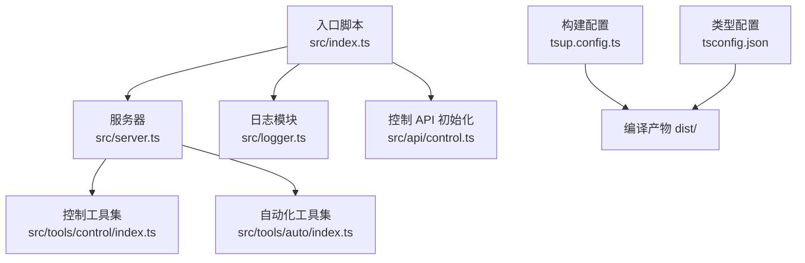
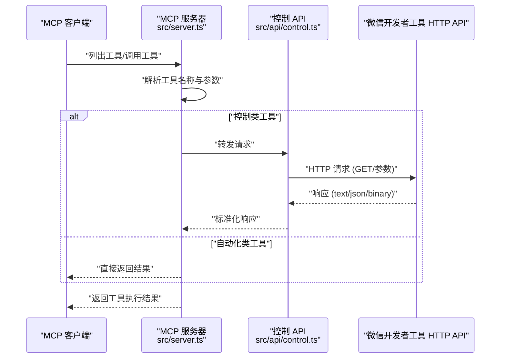
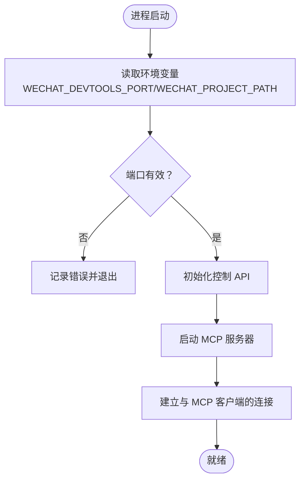
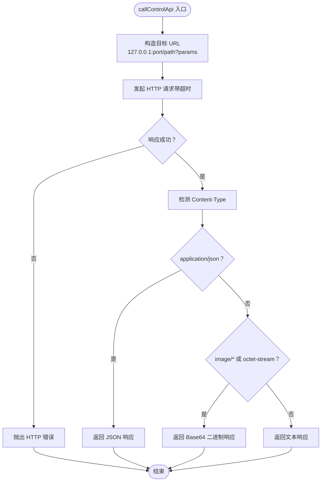

# 快速开始

<cite>
**本文引用的文件**
- [README.md](file://README.md)
- [package.json](file://package.json)
- [src/index.ts](file://src/index.ts)
- [src/server.ts](file://src/server.ts)
- [src/logger.ts](file://src/logger.ts)
- [src/api/control.ts](file://src/api/control.ts)
- [src/tools/control/index.ts](file://src/tools/control/index.ts)
- [src/tools/auto/index.ts](file://src/tools/auto/index.ts)
- [tsup.config.ts](file://tsup.config.ts)
- [tsconfig.json](file://tsconfig.json)
- [vitest.config.ts](file://vitest.config.ts)
- [src/api/control.test.ts](file://src/api/control.test.ts)
</cite>

## 目录
1. [简介](#简介)
2. [项目结构](#项目结构)
3. [核心组件](#核心组件)
4. [架构总览](#架构总览)
5. [详细组件分析](#详细组件分析)
6. [依赖分析](#依赖分析)
7. [性能考虑](#性能考虑)
8. [故障排查指南](#故障排查指南)
9. [结论](#结论)
10. [附录](#附录)

## 简介
本指南面向首次接触微信小程序 MCP 项目的用户，帮助你在最短时间内完成安装、环境准备、开发者工具配置与 MCP 客户端对接，实现小程序开发的自动化控制与可视化交互。你将获得：
- 完整的安装命令与构建流程
- 环境变量配置说明（WECHAT_DEVTOOLS_PORT、WECHAT_DEVTOOLS_CLI_PATH、WECHAT_PROJECT_PATH、LOG_LEVEL）
- 微信开发者工具设置步骤
- MCP 客户端配置示例
- 基本使用流程与常见问题排查

## 项目结构
该项目采用模块化的 TypeScript 结构，入口文件负责初始化控制 API 并启动 MCP 服务器；服务器负责注册工具集（控制类与自动化类），并通过标准输入输出与 MCP 客户端通信。

图表来源
- [src/index.ts:1-33](file://src/index.ts#L1-L33)
- [src/server.ts:14-71](file://src/server.ts#L14-L71)
- [src/api/control.ts:14-85](file://src/api/control.ts#L14-L85)
- [src/tools/control/index.ts:40-326](file://src/tools/control/index.ts#L40-L326)
- [src/tools/auto/index.ts:8-22](file://src/tools/auto/index.ts#L8-L22)
- [tsup.config.ts:1-17](file://tsup.config.ts#L1-L17)
- [tsconfig.json:1-22](file://tsconfig.json#L1-L22)

章节来源
- [src/index.ts:1-33](file://src/index.ts#L1-L33)
- [src/server.ts:14-71](file://src/server.ts#L14-L71)
- [tsup.config.ts:1-17](file://tsup.config.ts#L1-L17)
- [tsconfig.json:1-22](file://tsconfig.json#L1-L22)

## 核心组件
- 入口与启动：解析环境变量、初始化控制 API、启动 MCP 服务器。
- 服务器：注册工具列表与调用处理器，基于标准输入输出与 MCP 客户端通信。
- 工具集：控制类工具（如登录、预览、上传、构建 npm、清理缓存等）与自动化类工具（如连接、导航等）。
- 日志系统：支持 DEBUG/INFO/ERROR 三档日志级别，可通过 LOG_LEVEL 控制。
- 控制 API：封装对微信开发者工具 HTTP API 的请求，自动处理文本、JSON、二进制响应。

章节来源
- [src/index.ts:5-30](file://src/index.ts#L5-L30)
- [src/server.ts:14-71](file://src/server.ts#L14-L71)
- [src/tools/control/index.ts:40-326](file://src/tools/control/index.ts#L40-L326)
- [src/tools/auto/index.ts:8-22](file://src/tools/auto/index.ts#L8-L22)
- [src/logger.ts:3-24](file://src/logger.ts#L3-L24)
- [src/api/control.ts:29-85](file://src/api/control.ts#L29-L85)

## 架构总览
下图展示了从 MCP 客户端到微信开发者工具的整体调用链路与职责划分。

图表来源
- [src/server.ts:40-60](file://src/server.ts#L40-L60)
- [src/api/control.ts:29-85](file://src/api/control.ts#L29-L85)

## 详细组件分析

### 安装与运行
- 全局安装包后，可通过命令行直接启动 MCP 服务器。
- 开发模式与构建流程由脚本定义，便于本地调试与发布。

章节来源
- [README.md:5-8](file://README.md#L5-L8)
- [README.md:75-89](file://README.md#L75-L89)
- [package.json:14-21](file://package.json#L14-L21)

### 环境变量与配置
- 必填项：WECHAT_DEVTOOLS_PORT（开发者工具 HTTP 服务端口）
- 可选项：WECHAT_DEVTOOLS_CLI_PATH（自动化 API 需要）、WECHAT_PROJECT_PATH（默认项目路径）、LOG_LEVEL（日志级别）

章节来源
- [README.md:13-21](file://README.md#L13-L21)
- [src/index.ts:5-8](file://src/index.ts#L5-L8)
- [src/logger.ts:3](file://src/logger.ts#L3)

### 微信开发者工具设置
- 在开发者工具中开启“服务端口”，记录端口号（默认随机分配）。

章节来源
- [README.md:22-27](file://README.md#L22-L27)

### MCP 客户端配置示例
- 在 MCP 客户端配置中添加 mcpServers，指定命令与环境变量（含端口、CLI 路径、项目路径）。

章节来源
- [README.md:30-45](file://README.md#L30-L45)

### 控制类工具（wechat_control_*）
- 支持登录、检查登录状态、打开/关闭项目、预览、自动预览、上传、构建 npm、清理缓存、重置文件工具等。
- 大部分工具支持项目路径参数或回退至环境变量 WECHAT_PROJECT_PATH。

章节来源
- [README.md:47-74](file://README.md#L47-L74)
- [src/tools/control/index.ts:40-326](file://src/tools/control/index.ts#L40-L326)

### 自动化类工具（wechat_auto_*）
- 提供连接、页面导航等基础自动化能力，便于后续扩展。

章节来源
- [README.md:63-74](file://README.md#L63-L74)
- [src/tools/auto/index.ts:8-22](file://src/tools/auto/index.ts#L8-L22)

### 入口与服务器启动流程
- 解析端口与默认项目路径，校验端口有效性，初始化控制 API，启动 MCP 服务器并通过标准输入输出与客户端通信。

图表来源
- [src/index.ts:5-30](file://src/index.ts#L5-L30)
- [src/server.ts:65-71](file://src/server.ts#L65-L71)

章节来源
- [src/index.ts:5-30](file://src/index.ts#L5-L30)
- [src/server.ts:65-71](file://src/server.ts#L65-L71)

### 控制 API 请求处理流程
- 组装 URL（127.0.0.1:port + 路径 + 查询参数），设置超时，根据响应头判断内容类型，分别处理文本、JSON、二进制响应。

图表来源
- [src/api/control.ts:29-85](file://src/api/control.ts#L29-L85)

章节来源
- [src/api/control.ts:29-85](file://src/api/control.ts#L29-L85)

## 依赖分析
- 运行时依赖：@modelcontextprotocol/sdk（MCP 协议实现）、miniprogram-automator（小程序自动化相关能力）
- 开发依赖：tsup（打包）、typescript（类型系统）、vitest（测试）
- Node 引擎要求：>= 18.0.0

章节来源
- [package.json:34-46](file://package.json#L34-L46)

## 性能考虑
- 超时控制：控制 API 默认超时时间可按需调整，避免长时间阻塞。
- 日志级别：生产环境建议设置为 INFO，减少冗余输出。
- 构建优化：使用 ESM 输出与源码映射，便于调试与分发。

章节来源
- [src/index.ts:6-7](file://src/index.ts#L6-L7)
- [src/logger.ts:3-9](file://src/logger.ts#L3-L9)
- [tsup.config.ts:3-16](file://tsup.config.ts#L3-L16)

## 故障排查指南
- 端口未配置或无效：确保 WECHAT_DEVTOOLS_PORT 已正确设置且开发者工具已开启服务端口。
- 无法连接开发者工具：检查端口是否被占用、防火墙设置、以及网络连通性。
- 项目路径缺失：若未在工具参数中提供项目路径，需设置 WECHAT_PROJECT_PATH 环境变量。
- 超时错误：适当增大超时时间或检查开发者工具响应速度。
- 日志定位：通过 LOG_LEVEL 调整日志级别，收集更详细的诊断信息。

章节来源
- [src/index.ts:10-13](file://src/index.ts#L10-L13)
- [src/api/control.ts:48-50](file://src/api/control.ts#L48-L50)
- [src/logger.ts:3-9](file://src/logger.ts#L3-L9)

## 结论
通过本快速开始指南，你可以完成从安装、配置到与 MCP 客户端对接的全流程。建议先完成微信开发者工具的端口开启与环境变量设置，再在 MCP 客户端中添加对应配置，随后即可调用各类控制与自动化工具，实现小程序开发的高效自动化。

## 附录

### 安装与构建命令
- 全局安装：npm install -g wechat-miniprogram-mcp
- 开发模式：npm run dev
- 构建产物：npm run build
- 运行测试：npm run test

章节来源
- [README.md:5-8](file://README.md#L5-L8)
- [README.md:75-89](file://README.md#L75-L89)
- [package.json:14-21](file://package.json#L14-L21)

### 环境变量清单
- WECHAT_DEVTOOLS_PORT：必填，开发者工具 HTTP 服务端口
- WECHAT_DEVTOOLS_CLI_PATH：可选，自动化 API 需要
- WECHAT_PROJECT_PATH：可选，作为默认项目路径
- LOG_LEVEL：可选，DEBUG/INFO/ERROR，默认 INFO

章节来源
- [README.md:13-21](file://README.md#L13-L21)
- [src/index.ts:5-8](file://src/index.ts#L5-L8)
- [src/logger.ts:3](file://src/logger.ts#L3)

### 微信开发者工具设置步骤
- 打开微信开发者工具
- 设置 -> 安全 -> 开启服务端口
- 记录端口号（默认随机分配）

章节来源
- [README.md:22-27](file://README.md#L22-L27)

### MCP 客户端配置示例
- 在 MCP 客户端配置中添加 mcpServers，指定 command 为 wechat-miniprogram-mcp，并设置 env 中的端口、CLI 路径与项目路径。

章节来源
- [README.md:30-45](file://README.md#L30-L45)

### 基本使用流程
- 启动 MCP 服务器（入口会自动读取环境变量并启动）
- 在 MCP 客户端中调用工具（如 wechat_control_login、wechat_control_preview、wechat_control_upload 等）
- 查看日志与结果，必要时调整 LOG_LEVEL

章节来源
- [src/index.ts:21-30](file://src/index.ts#L21-L30)
- [README.md:47-74](file://README.md#L47-L74)
- [src/logger.ts:19-23](file://src/logger.ts#L19-L23)