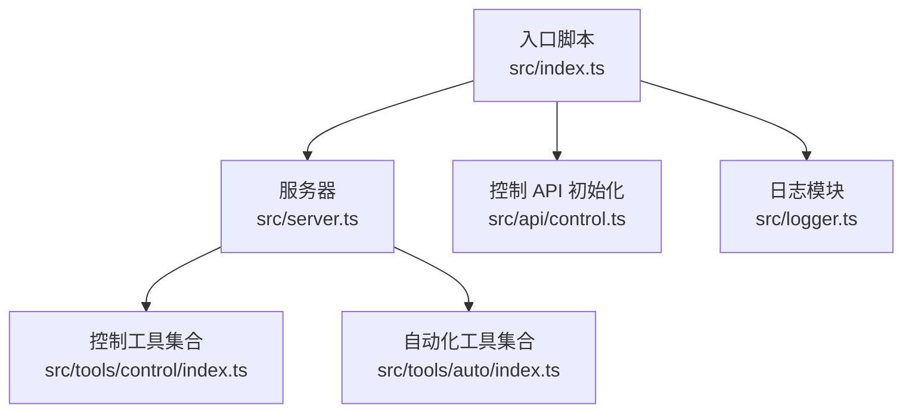
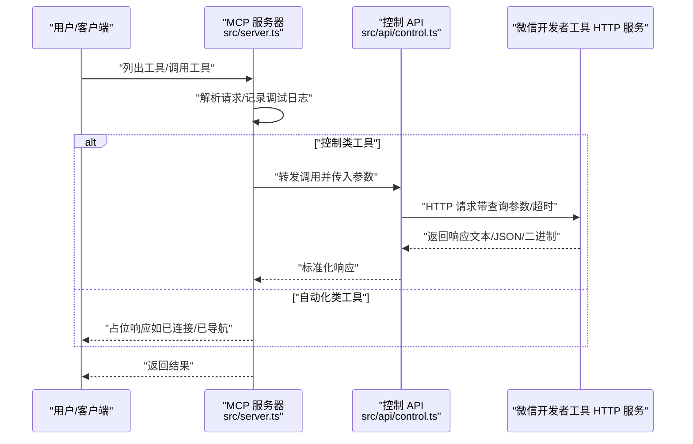
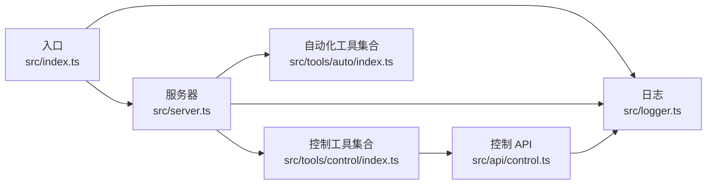

# 故障排除

<cite>
**本文引用的文件**
- [README.md](file://README.md)
- [package.json](file://package.json)
- [src/index.ts](file://src/index.ts)
- [src/server.ts](file://src/server.ts)
- [src/logger.ts](file://src/logger.ts)
- [src/api/control.ts](file://src/api/control.ts)
- [src/tools/control/index.ts](file://src/tools/control/index.ts)
- [src/tools/auto/index.ts](file://src/tools/auto/index.ts)
- [src/api/control.test.ts](file://src/api/control.test.ts)
- [scripts/check-shebang.js](file://scripts/check-shebang.js)
</cite>

## 目录
1. [简介](#简介)
2. [项目结构](#项目结构)
3. [核心组件](#核心组件)
4. [架构总览](#架构总览)
5. [详细组件分析](#详细组件分析)
6. [依赖关系分析](#依赖关系分析)
7. [性能与超时注意事项](#性能与超时注意事项)
8. [故障排除指南](#故障排除指南)
9. [结论](#结论)
10. [附录](#附录)

## 简介
本指南面向使用“微信小程序 MCP 服务器”的开发者与运维人员，聚焦于常见问题的系统性排查与解决：包括连接失败、权限问题、路径配置错误、日志调试、以及跨平台差异。文档基于仓库中的实现细节，提供可执行的排查步骤、错误信息解读、日志分析技巧，并给出针对不同操作系统的建议。

## 项目结构
该仓库采用按职责分层的组织方式：
- 入口与启动：入口脚本负责读取环境变量、初始化控制 API 并启动 MCP 服务器。
- 服务器与工具：MCP 服务器注册控制类与自动化类工具，统一处理请求与响应。
- 控制 API：封装对微信开发者工具 HTTP 控制接口的调用，含超时与内容类型处理。
- 日志模块：基于环境变量控制日志级别，输出到标准错误流。
- 工具定义：集中声明可用工具名称、描述与输入参数校验规则。

图表来源
- [src/index.ts:1-33](file://src/index.ts#L1-L33)
- [src/server.ts:14-71](file://src/server.ts#L14-L71)
- [src/api/control.ts:14-16](file://src/api/control.ts#L14-L16)
- [src/tools/control/index.ts:40-326](file://src/tools/control/index.ts#L40-L326)
- [src/tools/auto/index.ts:8-22](file://src/tools/auto/index.ts#L8-L22)
- [src/logger.ts:19-23](file://src/logger.ts#L19-L23)

章节来源
- [src/index.ts:1-33](file://src/index.ts#L1-L33)
- [src/server.ts:14-71](file://src/server.ts#L14-L71)
- [src/logger.ts:1-24](file://src/logger.ts#L1-L24)
- [src/api/control.ts:14-16](file://src/api/control.ts#L14-L16)
- [src/tools/control/index.ts:40-326](file://src/tools/control/index.ts#L40-L326)
- [src/tools/auto/index.ts:8-22](file://src/tools/auto/index.ts#L8-L22)

## 核心组件
- 入口与启动
  - 读取端口、默认项目路径、超时配置；校验端口有效性；初始化控制 API；启动 MCP 服务器。
- 服务器
  - 注册工具列表与调用处理器；根据工具名分派到控制或自动化工具；记录调试日志。
- 控制 API
  - 统一封装 HTTP 请求，支持查询参数、超时控制、内容类型识别（文本/JSON/二进制），并抛出明确错误。
- 工具集合
  - 控制类工具覆盖登录、预览、上传、构建 npm、清理缓存、重置文件监控等；自动化类工具当前提供连接与导航占位。
- 日志模块
  - 支持 DEBUG/INFO/ERROR 三个级别，按级别过滤输出，写入标准错误流。

章节来源
- [src/index.ts:5-30](file://src/index.ts#L5-L30)
- [src/server.ts:40-60](file://src/server.ts#L40-L60)
- [src/api/control.ts:29-84](file://src/api/control.ts#L29-L84)
- [src/tools/control/index.ts:40-326](file://src/tools/control/index.ts#L40-L326)
- [src/tools/auto/index.ts:8-22](file://src/tools/auto/index.ts#L8-L22)
- [src/logger.ts:5-23](file://src/logger.ts#L5-L23)

## 架构总览
下图展示 MCP 服务器从启动到处理工具调用的关键流程，以及与微信开发者工具 HTTP 接口的交互。

图表来源
- [src/server.ts:40-60](file://src/server.ts#L40-L60)
- [src/api/control.ts:29-84](file://src/api/control.ts#L29-L84)
- [src/tools/auto/index.ts:10-21](file://src/tools/auto/index.ts#L10-L21)

## 详细组件分析

### 组件一：入口与启动（src/index.ts）
- 关键点
  - 读取端口与默认项目路径，校验端口是否为有效数值；若未设置则直接退出。
  - 初始化控制 API（含端口、超时、默认项目路径）。
  - 启动 MCP 服务器；捕获异常并记录错误后退出。
- 常见问题
  - 端口未设置或非数值：启动即报错并退出。
  - 默认项目路径未设置：不影响服务器启动，但部分需要项目路径的工具会报缺少参数。
- 建议
  - 在启动前确保环境变量已正确导出。
  - 如需自动化能力，建议同时设置 CLI 路径与项目路径。

章节来源
- [src/index.ts:5-30](file://src/index.ts#L5-L30)

### 组件二：服务器与工具分发（src/server.ts）
- 关键点
  - 创建 MCP 服务器实例，注册工具列表与调用处理器。
  - 对未知工具名抛出错误；记录调试日志便于排障。
- 常见问题
  - 调用不存在的工具名：会收到“未知工具”错误。
  - 工具参数缺失：由具体工具的 handler 或上游参数校验逻辑处理。
- 建议
  - 使用列出工具接口确认可用工具清单。
  - 结合日志级别提升调试可见度。

章节来源
- [src/server.ts:14-71](file://src/server.ts#L14-L71)

### 组件三：控制 API（src/api/control.ts）
- 关键点
  - 统一构造目标 URL（固定 127.0.0.1 与端口），拼接查询参数。
  - 超时控制：基于 AbortController 实现请求中断。
  - 内容类型识别：JSON、二进制（含 image/* 与 application/octet-stream）、文本。
  - 错误处理：HTTP 非 OK、超时、连接失败均抛出明确错误信息。
- 常见问题
  - HTTP 非 OK：会携带状态码与响应体（若有）。
  - 超时：抛出“请求超时”或“连接失败”。
  - 二进制响应：返回 base64 数据与 MIME 类型。
- 建议
  - 提高日志级别以观察调试信息。
  - 遇到二进制响应时，注意接收方对 base64 的处理。

章节来源
- [src/api/control.ts:29-84](file://src/api/control.ts#L29-L84)

### 组件四：工具集合（src/tools/control/index.ts 与 src/tools/auto/index.ts）
- 控制类工具
  - 登录、预览、上传、打开/关闭项目、退出、自动预览、构建 npm、清理缓存、重置文件监控、检查登录状态等。
  - 多数工具支持项目路径参数，若未提供则回退到默认项目路径。
- 自动化类工具
  - 当前提供连接与导航占位，返回简单文本提示。
- 常见问题
  - 缺少项目路径：部分工具会显式要求项目路径。
  - 参数不合法：由 inputSchema 描述，调用侧应遵循。
- 建议
  - 使用列出工具接口查看输入参数与必填项。
  - 对需要 CLI 的场景，确保 CLI 路径与项目路径均正确。

章节来源
- [src/tools/control/index.ts:40-326](file://src/tools/control/index.ts#L40-L326)
- [src/tools/auto/index.ts:8-22](file://src/tools/auto/index.ts#L8-L22)

### 组件五：日志模块（src/logger.ts）
- 关键点
  - 通过 LOG_LEVEL 控制输出级别（DEBUG/INFO/ERROR）。
  - 输出到标准错误流，便于与业务输出分离。
- 常见问题
  - 日志过少：提高日志级别。
  - 日志过多：降低日志级别或仅关注 ERROR。
- 建议
  - 在排查阶段临时设为 DEBUG，问题定位后再恢复默认级别。

章节来源
- [src/logger.ts:3-23](file://src/logger.ts#L3-L23)

## 依赖关系分析
- 入口依赖服务器与日志模块；服务器依赖工具集合与日志模块；控制 API 作为工具调用的底层通道。
- 服务器与工具集合之间通过工具名进行解耦；控制 API 与外部 HTTP 服务耦合度较高，但内部封装了错误与超时处理。

图表来源
- [src/index.ts:1-4](file://src/index.ts#L1-L4)
- [src/server.ts:1-7](file://src/server.ts#L1-L7)
- [src/api/control.ts:14-16](file://src/api/control.ts#L14-L16)
- [src/tools/control/index.ts:1-2](file://src/tools/control/index.ts#L1-L2)
- [src/tools/auto/index.ts:1-6](file://src/tools/auto/index.ts#L1-L6)
- [src/logger.ts:1-3](file://src/logger.ts#L1-L3)

章节来源
- [src/index.ts:1-4](file://src/index.ts#L1-L4)
- [src/server.ts:1-7](file://src/server.ts#L1-L7)
- [src/api/control.ts:14-16](file://src/api/control.ts#L14-L16)
- [src/tools/control/index.ts:1-2](file://src/tools/control/index.ts#L1-L2)
- [src/tools/auto/index.ts:1-6](file://src/tools/auto/index.ts#L1-L6)
- [src/logger.ts:1-3](file://src/logger.ts#L1-L3)

## 性能与超时注意事项
- 超时策略
  - 控制 API 层面使用 AbortController 实现请求超时；超时错误会被包装为“连接失败”或“请求超时”。
  - 入口处设置了控制类工具超时与自动化类工具超时（默认值来自入口配置）。
- 影响因素
  - 网络延迟、开发者工具响应时间、项目规模与缓存状态。
- 建议
  - 在网络不稳定或项目较大时适当提高超时阈值。
  - 对耗时操作（如构建 npm、上传）结合日志观察进度。

章节来源
- [src/api/control.ts:48-54](file://src/api/control.ts#L48-L54)
- [src/index.ts:6-7](file://src/index.ts#L6-L7)

## 故障排除指南

### 一、连接失败
- 症状
  - 启动时报“端口无效”并退出；或运行中出现“无法连接到微信开发者工具”“请求超时”。
- 可能原因
  - 未设置端口或端口非数值；端口未开放或被占用；开发者工具未开启服务端口；网络不可达。
- 排查步骤
  1) 确认环境变量 WECHAT_DEVTOOLS_PORT 已设置且为有效数值。
  2) 在开发者工具中开启“服务端口”，记录实际端口。
  3) 使用本地回环地址与端口进行连通性测试（例如 curl 或浏览器访问）。
  4) 检查防火墙与安全软件是否拦截。
  5) 若超时频繁，适当提高超时阈值。
- 相关实现参考
  - 端口校验与退出：[src/index.ts:10-13](file://src/index.ts#L10-L13)
  - 超时与连接错误包装：[src/api/control.ts:48-54](file://src/api/control.ts#L48-L54)、[src/api/control.ts:77-83](file://src/api/control.ts#L77-L83)
- 日志建议
  - 提升日志级别至 DEBUG，观察请求与响应详情。

章节来源
- [src/index.ts:10-13](file://src/index.ts#L10-L13)
- [src/api/control.ts:48-54](file://src/api/control.ts#L48-L54)
- [src/api/control.ts:77-83](file://src/api/control.ts#L77-L83)

### 二、权限问题
- 症状
  - 调用登录或上传等需要鉴权的接口时失败，返回 HTTP 非 OK。
- 可能原因
  - 未登录或登录态失效；CLI 路径或项目路径无访问权限。
- 排查步骤
  1) 使用登录工具检查登录状态，必要时重新登录。
  2) 确保 CLI 路径与项目路径对当前用户可读写。
  3) 查看 HTTP 错误响应体中的具体错误信息（如项目配置缺失）。
- 相关实现参考
  - HTTP 非 OK 错误携带状态码与响应体：[src/api/control.ts:59-62](file://src/api/control.ts#L59-L62)
  - 登录与状态检查工具：[src/tools/control/index.ts:42-95](file://src/tools/control/index.ts#L42-L95)
- 日志建议
  - 观察服务器与控制 API 的错误堆栈与响应体。

章节来源
- [src/api/control.ts:59-62](file://src/api/control.ts#L59-L62)
- [src/tools/control/index.ts:42-95](file://src/tools/control/index.ts#L42-L95)

### 三、路径配置错误
- 症状
  - 预览、上传、构建 npm、清理缓存等工具报“缺少项目路径”或“找不到项目配置文件”。
- 可能原因
  - 未提供项目路径，且未设置默认项目路径；提供的路径不存在或无权限。
- 排查步骤
  1) 显式在调用参数中提供项目路径，或设置默认项目路径环境变量。
  2) 确认路径存在且可访问。
  3) 对需要 CLI 的场景，确保 CLI 路径也正确。
- 相关实现参考
  - 项目路径解析与默认回退：[src/tools/control/index.ts:23-32](file://src/tools/control/index.ts#L23-L32)、[src/api/control.ts:18-20](file://src/api/control.ts#L18-L20)
  - 工具对项目路径的要求：[src/tools/control/index.ts:126-128](file://src/tools/control/index.ts#L126-L128)、[src/tools/control/index.ts:174-175](file://src/tools/control/index.ts#L174-L175)
- 日志建议
  - 启用 DEBUG，核对工具调用时使用的项目路径。

章节来源
- [src/tools/control/index.ts:23-32](file://src/tools/control/index.ts#L23-L32)
- [src/api/control.ts:18-20](file://src/api/control.ts#L18-L20)
- [src/tools/control/index.ts:126-128](file://src/tools/control/index.ts#L126-L128)
- [src/tools/control/index.ts:174-175](file://src/tools/control/index.ts#L174-L175)

### 四、日志调试
- 启用详细日志
  - 设置环境变量 LOG_LEVEL 为 DEBUG/INFO/ERROR 中的任一级别。
- 分析要点
  - 观察服务器启动、工具列表、工具调用、控制 API 请求与响应。
  - 注意二进制响应的 MIME 类型与 base64 数据长度。
- 相关实现参考
  - 日志级别与输出：[src/logger.ts:3-23](file://src/logger.ts#L3-L23)
  - 服务器调试日志：[src/server.ts:41](file://src/server.ts#L41)、[src/server.ts:47](file://src/server.ts#L47)
  - 控制 API 调试日志：[src/server.ts:41](file://src/server.ts#L41)、[src/server.ts:47](file://src/server.ts#L47)

章节来源
- [src/logger.ts:3-23](file://src/logger.ts#L3-L23)
- [src/server.ts:41](file://src/server.ts#L41)
- [src/server.ts:47](file://src/server.ts#L47)

### 五、跨平台特殊问题
- macOS
  - CLI 路径通常位于应用包内；确保路径正确且可执行。
  - 若使用终端或 CI，注意沙盒与权限限制。
- Windows/Linux
  - 端口占用与防火墙可能影响连接；优先使用低冲突端口。
  - 路径分隔符与大小写敏感性需注意。
- 通用建议
  - 在 CI 环境中，建议显式设置所有必需环境变量并在启动前做一次连通性自检。

### 六、常见错误信息解读
- “端口无效”
  - 说明：WECHAT_DEVTOOLS_PORT 未设置或非数值。
  - 处理：设置为有效整数端口。
  - 参考：[src/index.ts:10-13](file://src/index.ts#L10-L13)
- “HTTP X: …”
  - 说明：开发者工具返回非 2xx，错误体中常包含具体原因（如项目配置缺失）。
  - 处理：根据错误体调整项目路径或配置。
  - 参考：[src/api/control.ts:59-62](file://src/api/control.ts#L59-L62)
- “请求超时”
  - 说明：超过控制 API 超时阈值未返回。
  - 处理：提高超时阈值或优化网络/工具性能。
  - 参考：[src/api/control.ts:48-54](file://src/api/control.ts#L48-L54)
- “无法连接到微信开发者工具”
  - 说明：fetch 抛错或 AbortController 中断。
  - 处理：检查端口、网络、工具状态。
  - 参考：[src/api/control.ts:77-83](file://src/api/control.ts#L77-L83)

章节来源
- [src/index.ts:10-13](file://src/index.ts#L10-L13)
- [src/api/control.ts:59-62](file://src/api/control.ts#L59-L62)
- [src/api/control.ts:48-54](file://src/api/control.ts#L48-L54)
- [src/api/control.ts:77-83](file://src/api/control.ts#L77-L83)

### 七、验证配置正确性
- 端口与路径
  - 使用列出工具接口确认工具清单；尝试调用登录/状态检查工具验证鉴权链路。
- 二进制响应
  - 对预览二维码等二进制响应，确认接收方能正确解析 base64 与 MIME 类型。
- 超时与稳定性
  - 在网络波动环境下提高超时阈值，观察日志定位瓶颈。
- 相关实现参考
  - 工具列表与调用：[src/server.ts:40-60](file://src/server.ts#L40-L60)
  - 二进制响应处理：[src/api/control.ts:70-76](file://src/api/control.ts#L70-L76)

章节来源
- [src/server.ts:40-60](file://src/server.ts#L40-L60)
- [src/api/control.ts:70-76](file://src/api/control.ts#L70-L76)

### 八、自动化工具现状与建议
- 当前自动化工具为占位实现，返回简单文本提示。
- 建议
  - 在具备 CLI 与项目路径的前提下，优先使用控制类工具完成核心流程。
  - 关注后续版本对自动化工具的完善。

章节来源
- [src/tools/auto/index.ts:10-21](file://src/tools/auto/index.ts#L10-L21)

## 结论
通过结合入口配置、服务器工具分发、控制 API 的统一错误与超时处理、以及可调节的日志级别，本项目提供了清晰的排障路径。建议在日常使用中：
- 明确设置端口与默认项目路径；
- 在调试阶段启用 DEBUG 日志；
- 遇到连接与超时问题时，优先检查端口与网络；
- 对路径与权限问题，逐项核对 CLI 与项目路径；
- 利用列出工具接口与最小复现步骤定位问题根因。

## 附录

### A. 环境变量与工具对照
- 环境变量
  - WECHAT_DEVTOOLS_PORT：必填，开发者工具服务端口。
  - WECHAT_DEVTOOLS_CLI_PATH：可选，自动化 API 需要。
  - WECHAT_PROJECT_PATH：可选，作为默认项目路径。
  - LOG_LEVEL：可选，DEBUG/INFO/ERROR。
- 工具清单（控制类）
  - 登录、检查登录、预览、上传、自动预览、打开、关闭、退出、构建 npm、清理缓存、重置文件监控等。
- 工具清单（自动化类）
  - 连接、导航（占位）。

章节来源
- [README.md:13-21](file://README.md#L13-L21)
- [README.md:47-74](file://README.md#L47-L74)
- [src/tools/control/index.ts:40-326](file://src/tools/control/index.ts#L40-L326)
- [src/tools/auto/index.ts:8-22](file://src/tools/auto/index.ts#L8-L22)

### B. 启动与构建脚本检查
- 启动脚本
  - 入口二进制名为 wechat-miniprogram-mcp，指向 dist/index.js。
- 构建与校验
  - 构建产物包含 shebang 检查脚本，确保二进制可执行。
- 相关实现参考
  - 二进制映射与脚本：[package.json:7-9](file://package.json#L7-L9)、[package.json:14-20](file://package.json#L14-L20)
  - shebang 校验：[scripts/check-shebang.js:8-21](file://scripts/check-shebang.js#L8-L21)

章节来源
- [package.json:7-9](file://package.json#L7-L9)
- [package.json:14-20](file://package.json#L14-L20)
- [scripts/check-shebang.js:8-21](file://scripts/check-shebang.js#L8-L21)