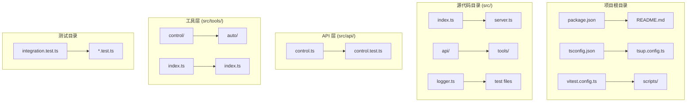
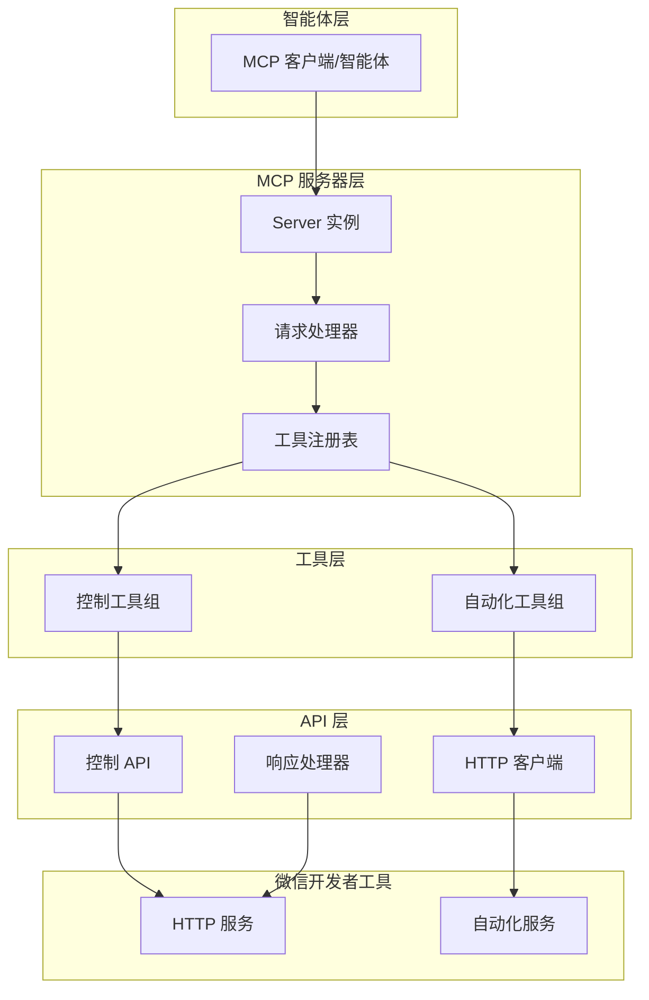
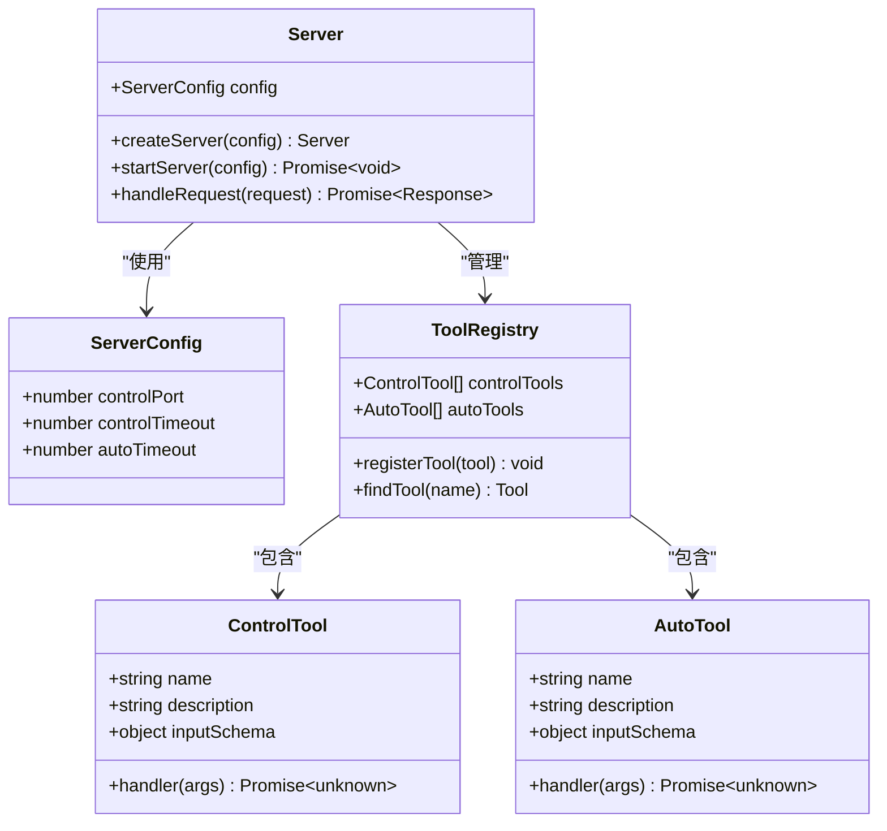
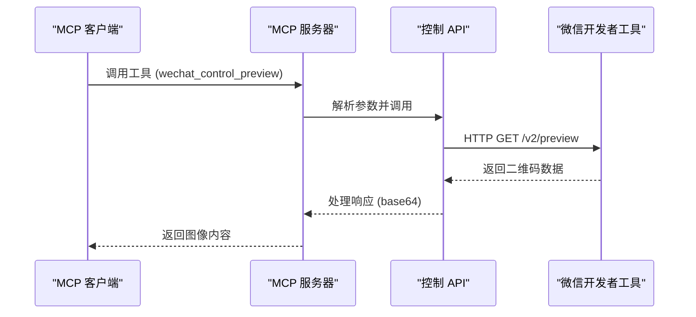
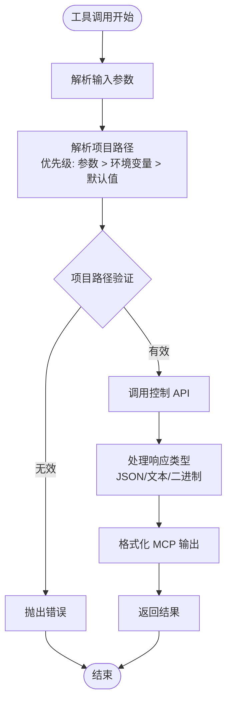

# 架构概览

<cite>
**本文档引用的文件**
- [README.md](file://README.md)
- [package.json](file://package.json)
- [src/index.ts](file://src/index.ts)
- [src/server.ts](file://src/server.ts)
- [src/api/control.ts](file://src/api/control.ts)
- [src/tools/control/index.ts](file://src/tools/control/index.ts)
- [src/tools/auto/index.ts](file://src/tools/auto/index.ts)
- [src/logger.ts](file://src/logger.ts)
- [src/integration.test.ts](file://src/integration.test.ts)
- [src/api/control.test.ts](file://src/api/control.test.ts)
- [src/tools/control/index.test.ts](file://src/tools/control/index.test.ts)
- [tsconfig.json](file://tsconfig.json)
- [tsup.config.ts](file://tsup.config.ts)
- [vitest.config.ts](file://vitest.config.ts)
</cite>

## 目录
1. [简介](#简介)
2. [项目结构](#项目结构)
3. [核心组件](#核心组件)
4. [架构总览](#架构总览)
5. [详细组件分析](#详细组件分析)
6. [依赖关系分析](#依赖关系分析)
7. [性能考虑](#性能考虑)
8. [故障排除指南](#故障排除指南)
9. [结论](#结论)

## 简介

wechat-miniprogram-mcp 是一个专为微信小程序开发设计的 MCP (Model Context Protocol) 服务器，旨在通过微信开发者工具的 HTTP API 和自动化 API 实现小程序开发的自动化操作。该项目采用模块化架构设计，将 API 层与工具层分离，提供了清晰的控制 API 和自动化 API 功能划分。

该系统的核心目标是：
- 提供与微信开发者工具的无缝集成
- 支持通过 MCP 协议进行智能体驱动的小程序开发
- 实现开发流程的自动化和智能化
- 保持良好的扩展性和维护性

## 项目结构

项目采用基于功能的模块化组织方式，主要分为以下几个核心目录：



**图表来源**
- [src/index.ts:1-33](file://src/index.ts#L1-L33)
- [src/server.ts:1-71](file://src/server.ts#L1-L71)
- [src/api/control.ts:1-85](file://src/api/control.ts#L1-L85)

**章节来源**
- [package.json:1-48](file://package.json#L1-L48)
- [tsconfig.json:1-22](file://tsconfig.json#L1-L22)
- [tsup.config.ts:1-17](file://tsup.config.ts#L1-L17)

## 核心组件

### MCP 服务器核心

MCP 服务器是整个系统的核心，负责处理来自智能体的请求并协调各种工具的执行。服务器采用标准的 MCP 协议实现，支持工具发现和调用机制。

### API 层设计

API 层专门负责与微信开发者工具进行 HTTP 通信，提供了统一的接口来访问开发者工具的各种功能。当前实现了控制 API 的完整功能集。

### 工具层架构

工具层将不同的功能划分为控制工具和自动化工具两大类：

- **控制工具**: 直接调用微信开发者工具的 HTTP API
- **自动化工具**: 提供更高级别的自动化操作能力

**章节来源**
- [src/server.ts:14-63](file://src/server.ts#L14-L63)
- [src/tools/control/index.ts:40-326](file://src/tools/control/index.ts#L40-L326)
- [src/tools/auto/index.ts:8-22](file://src/tools/auto/index.ts#L8-L22)

## 架构总览

系统采用分层架构设计，实现了 API 层与工具层的清晰分离：



**图表来源**
- [src/server.ts:14-63](file://src/server.ts#L14-L63)
- [src/index.ts:21-30](file://src/index.ts#L21-L30)

### 系统边界定义

系统边界清晰地定义了各层之间的职责划分：

**内部边界**：
- MCP 服务器与工具层：通过标准化的工具接口进行通信
- 工具层与 API 层：通过统一的 API 调用接口进行交互
- API 层与微信开发者工具：通过 HTTP 协议进行通信

**外部边界**：
- 智能体/客户端：通过 MCP 协议与服务器交互
- 微信开发者工具：提供底层的开发工具服务

## 详细组件分析

### MCP 服务器组件

MCP 服务器实现了标准的 MCP 协议，提供了工具发现和调用功能：



**图表来源**
- [src/server.ts:8-12](file://src/server.ts#L8-L12)
- [src/server.ts:27-38](file://src/server.ts#L27-L38)
- [src/tools/control/index.ts:3-8](file://src/tools/control/index.ts#L3-L8)
- [src/tools/auto/index.ts:1-6](file://src/tools/auto/index.ts#L1-L6)

### 控制 API 组件

控制 API 提供了与微信开发者工具 HTTP 服务的直接通信能力：



**图表来源**
- [src/tools/control/index.ts:126-145](file://src/tools/control/index.ts#L126-L145)
- [src/api/control.ts:29-84](file://src/api/control.ts#L29-L84)

### 工具层组件

工具层实现了具体的业务逻辑，每个工具都遵循统一的接口规范：



**图表来源**
- [src/tools/control/index.ts:23-38](file://src/tools/control/index.ts#L23-L38)
- [src/tools/control/index.ts:10-19](file://src/tools/control/index.ts#L10-L19)

**章节来源**
- [src/server.ts:45-60](file://src/server.ts#L45-L60)
- [src/api/control.ts:14-16](file://src/api/control.ts#L14-L16)
- [src/tools/control/index.ts:40-326](file://src/tools/control/index.ts#L40-L326)

## 依赖关系分析

项目采用了现代化的 Node.js 开发栈，主要依赖包括：

```mermaid
graph TB
subgraph "运行时依赖"
A[@modelcontextprotocol/sdk] --> B[MCP 协议实现]
C[miniprogram-automator] --> D[小程序自动化]
end
subgraph "开发依赖"
E[typescript] --> F[类型检查]
G[tsup] --> H[打包工具]
I[vitest] --> J[测试框架]
K[@types/node] --> L[Node.js 类型]
end
subgraph "构建配置"
M[tsconfig.json] --> N[编译选项]
O[tsup.config.ts] --> P[打包配置]
Q[vitest.config.ts] --> R[测试配置]
end
```

**图表来源**
- [package.json:34-43](file://package.json#L34-L43)
- [tsconfig.json:2-18](file://tsconfig.json#L2-L18)
- [tsup.config.ts:3-16](file://tsup.config.ts#L3-L16)

### 技术决策考量

1. **MCP 协议选择**: 采用标准的 MCP 协议确保了与各种智能体平台的兼容性
2. **模块化设计**: API 层与工具层分离，提高了代码的可维护性和可测试性
3. **类型安全**: 使用 TypeScript 确保代码质量和开发体验
4. **异步架构**: 基于 Promise 和 async/await 的异步设计，提升系统响应性
5. **环境变量配置**: 通过环境变量实现灵活的部署配置

**章节来源**
- [package.json:34-46](file://package.json#L34-L46)
- [src/index.ts:5-8](file://src/index.ts#L5-L8)

## 性能考虑

### 并发处理
- 服务器采用单线程事件循环模型，适合 I/O 密集型的 API 调用场景
- 每个工具调用都是独立的异步操作，避免阻塞其他请求

### 超时机制
- 控制 API 超时时间可配置，默认 30 秒
- 自动化 API 超时时间较长，默认 60 秒
- 使用 AbortController 实现优雅的超时处理

### 内存管理
- 采用流式处理二进制数据，避免大对象内存占用
- 及时清理超时定时器和网络连接

## 故障排除指南

### 常见问题诊断

1. **连接失败**
   - 检查微信开发者工具是否已启动
   - 验证 WECHAT_DEVTOOLS_PORT 环境变量设置
   - 确认防火墙设置允许本地连接

2. **项目路径错误**
   - 确保项目路径存在且可访问
   - 检查项目配置文件完整性
   - 验证权限设置

3. **超时问题**
   - 增加超时时间配置
   - 检查网络连接稳定性
   - 监控开发者工具响应时间

**章节来源**
- [src/api/control.ts:48-84](file://src/api/control.ts#L48-L84)
- [src/tools/control/index.ts:34-38](file://src/tools/control/index.ts#L34-L38)

## 结论

wechat-miniprogram-mcp 项目展现了现代 Node.js 应用的良好实践，通过清晰的分层架构和模块化设计，成功实现了与微信开发者工具的深度集成。系统的主要优势包括：

1. **架构清晰**: 分层设计使得代码结构易于理解和维护
2. **功能完整**: 覆盖了微信开发者工具的主要功能点
3. **扩展性强**: 模块化设计便于添加新的工具和功能
4. **测试完备**: 全面的单元测试和集成测试保证了代码质量
5. **配置灵活**: 通过环境变量实现灵活的部署配置

该系统为小程序开发的智能化和自动化提供了坚实的技术基础，为未来的功能扩展和技术演进奠定了良好基础。