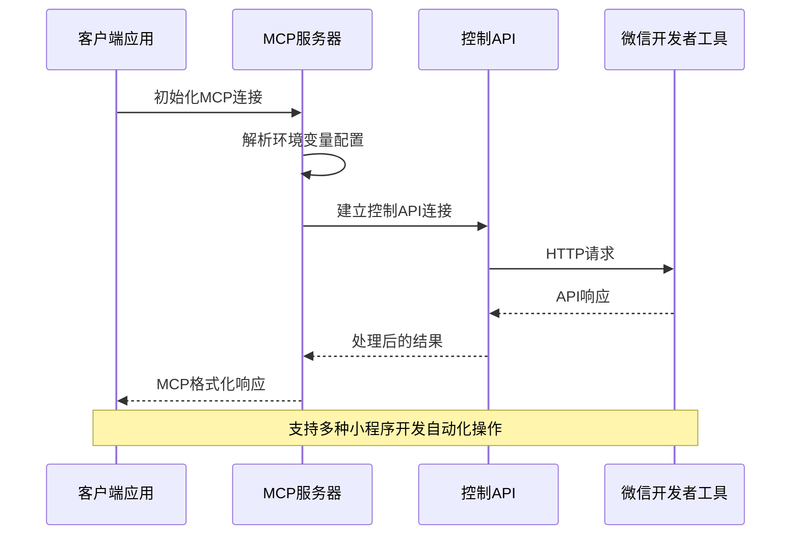
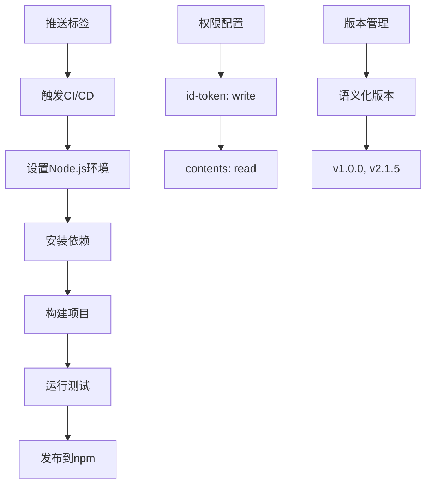

# 配置指南

<cite>
**本文档引用的文件**
- [package.json](file://package.json)
- [tsup.config.ts](file://tsup.config.ts)
- [vitest.config.ts](file://vitest.config.ts)
- [.github/workflows/publish.yml](file://.github/workflows/publish.yml)
- [src/logger.ts](file://src/logger.ts)
- [src/index.ts](file://src/index.ts)
- [src/server.ts](file://src/server.ts)
- [src/api/control.ts](file://src/api/control.ts)
- [src/tools/control/index.ts](file://src/tools/control/index.ts)
- [src/tools/auto/index.ts](file://src/tools/auto/index.ts)
- [README.md](file://README.md)
- [scripts/check-shebang.js](file://scripts/check-shebang.js)
</cite>

## 目录
1. [简介](#简介)
2. [项目结构](#项目结构)
3. [核心配置组件](#核心配置组件)
4. [架构概览](#架构概览)
5. [详细配置分析](#详细配置分析)
6. [依赖关系分析](#依赖关系分析)
7. [性能考虑](#性能考虑)
8. [故障排除指南](#故障排除指南)
9. [结论](#结论)

## 简介

本指南详细说明了微信小程序MCP服务器的完整配置方案。该系统通过MCP协议与微信开发者工具进行交互，支持小程序开发的自动化操作。项目采用TypeScript开发，使用Node.js运行时，支持跨平台部署。

## 项目结构

项目采用模块化的目录结构，主要包含以下核心部分：

```mermaid
graph TB
subgraph "项目根目录"
A[src/] -- 源代码 -->
B[dist/] -- 构建输出 -->
C[scripts/] -- 构建脚本 -->
D[docs/] -- 文档 -->
E[.github/workflows/] -- CI/CD -->
end
subgraph "源代码结构"
F[index.ts] -- 入口点
G[server.ts] -- 服务器逻辑
H[logger.ts] -- 日志系统
I[api/control.ts] -- 控制API
J[tools/] -- 工具实现
end
subgraph "配置文件"
K[package.json] -- 项目配置
L[tsup.config.ts] -- 构建配置
M[vitest.config.ts] -- 测试配置
N[publish.yml] -- 发布配置
end
```

**图表来源**
- [package.json:1-48](file://package.json#L1-L48)
- [tsup.config.ts:1-17](file://tsup.config.ts#L1-L17)

**章节来源**
- [package.json:1-48](file://package.json#L1-L48)
- [tsup.config.ts:1-17](file://tsup.config.ts#L1-L17)

## 核心配置组件

### 环境变量配置

项目支持以下关键环境变量：

| 变量名 | 说明 | 必填 | 默认值 | 示例值 |
|--------|------|------|--------|--------|
| WECHAT_DEVTOOLS_PORT | 微信开发者工具HTTP服务端口 | 是 | - | 20000 |
| WECHAT_DEVTOOLS_CLI_PATH | 微信开发者工具CLI路径 | 否 | - | `/Applications/wechatdevtools.app/Contents/MacOS/cli` |
| WECHAT_PROJECT_PATH | 小程序项目路径 | 否 | - | `/path/to/your/project` |
| LOG_LEVEL | 日志级别 | 否 | INFO | DEBUG/INFO/ERROR |

### 日志系统配置

日志系统支持三种级别：
- DEBUG：详细调试信息
- INFO：一般运行信息  
- ERROR：错误信息

**章节来源**
- [src/index.ts:5-19](file://src/index.ts#L5-L19)
- [src/logger.ts:3-9](file://src/logger.ts#L3-L9)

## 架构概览

系统采用MCP（Model Context Protocol）服务器架构，通过STDIO传输与客户端通信：



**图表来源**
- [src/server.ts:65-70](file://src/server.ts#L65-L70)
- [src/api/control.ts:29-84](file://src/api/control.ts#L29-L84)

## 详细配置分析

### 环境变量详解

#### 必填环境变量

**WECHAT_DEVTOOLS_PORT**
- 类型：整数
- 范围：1024-65535
- 作用：指定微信开发者工具HTTP服务监听端口
- 验证：必须为有效数字，否则启动失败

#### 可选环境变量

**WECHAT_DEVTOOLS_CLI_PATH**
- 类型：字符串（文件路径）
- 作用：指定微信开发者工具CLI可执行文件路径
- 必填场景：使用自动化API功能时

**WECHAT_PROJECT_PATH**
- 类型：字符串（文件路径）
- 作用：指定默认小程序项目路径
- 功能：作为工具调用的默认项目参数

**LOG_LEVEL**
- 类型：枚举值
- 可选值：DEBUG/INFO/ERROR
- 作用：控制日志输出详细程度

### 平台特定配置

#### macOS路径配置
- 标准安装路径：`/Applications/wechatdevtools.app/Contents/MacOS/cli`
- 可能的替代路径：`/usr/local/bin/wx-devtools`

#### Windows路径配置
- 标准安装路径：`C:\Program Files (x86)\Tencent\微信开发者工具\cli.bat`
- 用户目录路径：`%USERPROFILE%\AppData\Roaming\微信开发者工具\cli.bat`

#### Linux路径配置
- 标准安装路径：`~/.local/share/微信开发者工具/cli`
- 可能的替代路径：`~/微信开发者工具/cli`

### 构建配置

#### TypeScript编译配置

项目使用tsup进行构建，配置特点：
- 目标环境：Node.js 18+
- 输出格式：ESM模块
- 源码映射：启用
- 外部依赖：保留@modelcontextprotocol包

#### 包管理配置

**Node.js版本要求**
- 最低版本：18.0.0
- 推荐版本：24.x

**依赖管理**
- 运行时依赖：@modelcontextprotocol/sdk, miniprogram-automator
- 开发依赖：typescript, tsup, vitest

**章节来源**
- [package.json:44-46](file://package.json#L44-L46)
- [tsup.config.ts:3-16](file://tsup.config.ts#L3-L16)

### 测试配置

测试框架使用Vitest，配置包括：
- 测试环境：Node.js
- 测试文件：src/**/*.test.ts
- 排除文件：src/integration.test.ts

### GitHub Actions自动发布

#### 发布流程



**图表来源**
- [.github/workflows/publish.yml:12-26](file://.github/workflows/publish.yml#L12-L26)

#### 发布条件
- 触发事件：推送到以`v`开头的标签
- 权限要求：需要`id-token: write`权限
- 缓存策略：禁用包管理器缓存

**章节来源**
- [.github/workflows/publish.yml:1-27](file://.github/workflows/publish.yml#L1-L27)

## 依赖关系分析

### 核心依赖关系

```mermaid
graph LR
A[wechat-miniprogram-mcp] --> B[@modelcontextprotocol/sdk]
A --> C[miniprogram-automator]
A --> D[Node.js 18+]
E[Vitest] --> F[测试框架]
G[Tsup] --> H[构建工具]
I[TypeScript] --> J[类型检查]
A --> E
A --> G
A --> I
```

**图表来源**
- [package.json:34-42](file://package.json#L34-L42)

### 组件耦合度

系统采用松耦合设计：
- 服务器层与API层分离
- 工具层独立可扩展
- 配置层集中管理

**章节来源**
- [src/server.ts:8-12](file://src/server.ts#L8-L12)
- [src/api/control.ts:14-16](file://src/api/control.ts#L14-L16)

## 性能考虑

### 内存管理
- 使用AbortController实现请求超时
- 及时清理超时请求资源
- 合理设置超时时间（控制API：30秒，自动化API：60秒）

### 网络优化
- HTTP请求使用连接复用
- 二进制数据采用Base64编码传输
- 错误重试机制避免频繁失败

### 日志性能
- 按级别过滤日志输出
- 异步日志写入避免阻塞主线程

## 故障排除指南

### 常见配置问题

#### 端口冲突
**问题**：启动时报端口占用错误
**解决方案**：
1. 检查WECHAT_DEVTOOLS_PORT是否被其他进程占用
2. 修改为未使用的端口号（建议使用30000以上）
3. 确认防火墙设置允许该端口通信

#### CLI路径错误
**问题**：自动化功能无法使用
**解决方案**：
1. 验证WECHAT_DEVTOOLS_CLI_PATH路径正确性
2. 确认CLI文件具有执行权限
3. 在macOS上使用正确的.app bundle路径

#### 项目路径问题
**问题**：工具调用报项目路径错误
**解决方案**：
1. 确保WECHAT_PROJECT_PATH指向有效的小程序项目
2. 检查项目包含app.json或project.config.json
3. 验证项目路径权限访问

#### 日志级别配置
**问题**：日志输出过多或过少
**解决方案**：
1. 设置LOG_LEVEL为DEBUG获取详细信息
2. 设置LOG_LEVEL为ERROR仅显示错误
3. 默认INFO级别提供平衡的日志输出

### 调试技巧

#### 启用详细日志
```bash
export LOG_LEVEL=DEBUG
export WECHAT_DEVTOOLS_PORT=20000
node dist/index.js
```

#### 验证配置
使用以下命令验证基本配置：
```bash
# 检查端口连通性
telnet localhost 20000

# 验证CLI可执行性
ls -la "$WECHAT_DEVTOOLS_CLI_PATH"

# 检查项目路径
ls -la "$WECHAT_PROJECT_PATH"
```

**章节来源**
- [src/index.ts:10-13](file://src/index.ts#L10-L13)
- [src/logger.ts:11-17](file://src/logger.ts#L11-L17)

## 结论

本配置指南提供了微信小程序MCP服务器的完整设置方案。通过合理配置环境变量、构建参数和发布流程，可以确保系统稳定运行并支持各种小程序开发自动化场景。

关键要点：
- 环境变量配置是系统运行的基础
- 跨平台兼容性需要特别注意路径配置
- 自动发布流程简化了部署过程
- 完善的错误处理机制提高了系统可靠性

建议在生产环境中：
1. 使用正式版本标签进行发布
2. 配置适当的日志级别
3. 建立监控和告警机制
4. 定期更新依赖包保持安全性